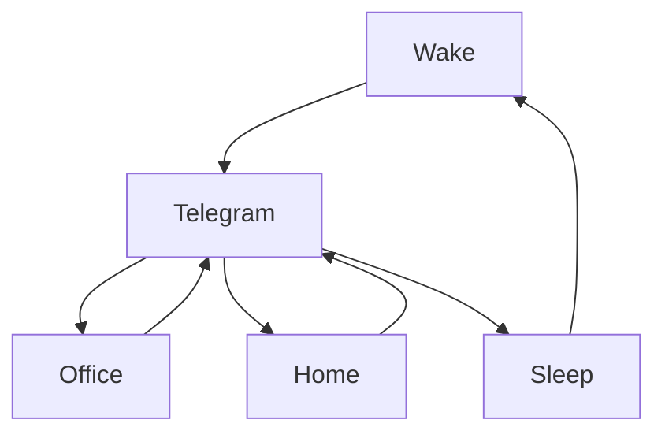

### 🎬 1tamilmv RSS Feed

<!-- BLOG-POST-LIST:START -->
- [@Benzmovies - RRR &lpar;2022&rpar; 2160p HQ ZEE5 WEB-DL x265 10bit [Telugu &lpar;DD+ 5.1 ATMOS - 448Kbps&rpar;] ESubs Benz.mkv 14GB](https://www.1tamilmv.cloud/index.php?/forums/topic/164356-benzmovies-rrr-2022-2160p-hq-zee5-web-dl-x265-10bit-telugu-dd-51-atmos-448kbps-esubs-benzmkv-14gb/&do=findComment&comment=328776)
- [@Benzmoviez - Ispade Rajavum Idhaya Raniyum &lpar;2019&rpar; Tamil AMZN - WEB-DL - 1080p - AVC - DDP - 2.0 - 5.3GB Benz.mkv](https://www.1tamilmv.cloud/index.php?/forums/topic/164355-benzmoviez-ispade-rajavum-idhaya-raniyum-2019-tamil-amzn-web-dl-1080p-avc-ddp-20-53gb-benzmkv/&do=findComment&comment=328775)
- [@Benzmovies - Arjun Reddy 2017 1080p AMZN WEB-DL TELUGU DDP5.1 H.264 Benz.mkv 9.0GB](https://www.1tamilmv.cloud/index.php?/forums/topic/164354-benzmovies-arjun-reddy-2017-1080p-amzn-web-dl-telugu-ddp51-h264-benzmkv-90gb/&do=findComment&comment=328774)
- [Obi-Wan Kenobi &lpar;2022&rpar; Complete S01 [4k 2160p + 1080p +720p ]  HS WEB-DL &lpar;DD+5.1 192kbps Telugu+Tamil+Hindi+English&rpar; HEVC +AVC &lpar;DV+HDR+SDR&rpar; [42GB+10GB+14GB+8GB+4GB]](https://www.1tamilmv.cloud/index.php?/forums/topic/164353-obi-wan-kenobi-2022-complete-s01-4k-2160p-1080p-720p-hs-web-dl-dd51-192kbps-telugutamilhindienglish-hevc-avc-dvhdrsdr-42gb10gb14gb8gb4gb/&do=findComment&comment=328773)
- [[60FPS|IMAX] - Doctor.Strange.in.the.Multiverse.of.Madness.2022.IMAX.10bit.DSNP.WEBRip.Multi.DDP5.1.Esubs.x265.HEVC - 1080p | 720p - 9.93 GB | 2.94 GB | 2.11 GB](https://www.1tamilmv.cloud/index.php?/forums/topic/164352-60fpsimax-doctorstrangeinthemultiverseofmadness2022imax10bitdsnpwebripmultiddp51esubsx265hevc-1080p-720p-993-gb-294-gb-211-gb/&do=findComment&comment=328772)
<!-- BLOG-POST-LIST:END -->

# =====Spotify Playlist=====

 

 
<h3 align="center">  </h3>
 

<H1>My Routine</H1>

 

    
    
    

