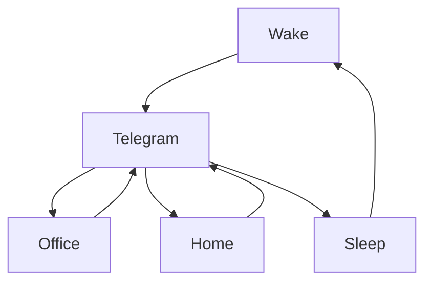
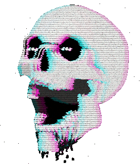

### 🎬 1tamilmv RSS Feed

<!-- BLOG-POST-LIST:START -->
- [Khuda Haafiz Chapter 2 Agni Pariksha [2022] Hindi HQ PreDVD Gdrive Links](https://www.1tamilmv.space/index.php?/forums/topic/165237-khuda-haafiz-chapter-2-agni-pariksha-2022-hindi-hq-predvd-gdrive-links/&do=findComment&comment=330204)
- [🔰Vikram &lpar;2022&rpar; - [Telugu Version] - TRUE WEB-DL - &lpar;1080p&rpar; - HQ - AVC - [UNTOUCHED] - &lpar;DD+ 5.1 - 192Kbps&rpar; - [4.38GB] - &lpar;GOOGLE DRIVE LINK&rpar;🔰](https://www.1tamilmv.space/index.php?/forums/topic/165236-%F0%9F%94%B0vikram-2022-telugu-version-true-web-dl-1080p-hq-avc-untouched-dd-51-192kbps-438gb-google-drive-link%F0%9F%94%B0/&do=findComment&comment=330203)
- [Khuda Haafiz Chapter II: Agni Pariksha &lpar;2022&rpar; Hindi HQ PreDVD - [1080p &amp; 720p - x264 - 2.3GB - 1.3GB | x264 - 700MB - 400MB] - HQ Clean Audio](https://www.1tamilmv.space/index.php?/forums/topic/165235-khuda-haafiz-chapter-ii-agni-pariksha-2022-hindi-hq-predvd-1080p-720p-x264-23gb-13gb-x264-700mb-400mb-hq-clean-audio/&do=findComment&comment=330202)
- [Mirattal Mannan HD 720p Chinees Tamil dubbed [MEGA - Download]](https://www.1tamilmv.space/index.php?/forums/topic/165234-mirattal-mannan-hd-720p-chinees-tamil-dubbed-mega-download/&do=findComment&comment=330201)
- [Kaduva &lpar;2022&rpar; Malayalam Full Movie Watch Now HQ For Free](https://www.1tamilmv.space/index.php?/forums/topic/165233-kaduva-2022-malayalam-full-movie-watch-now-hq-for-free/&do=findComment&comment=330200)
<!-- BLOG-POST-LIST:END -->

# =====Spotify Playlist=====

 

 
<h3 align="center">  </h3>
 

<H1>My Routine</H1>

 

    
    
    

     

# Humans

# Bike N Angel

# Hypnotic Loop

https://user-images.githubusercontent.com/47528708/176845771-6ad8f1d2-8008-4f49-ac35-5ebb89644732.mp4

