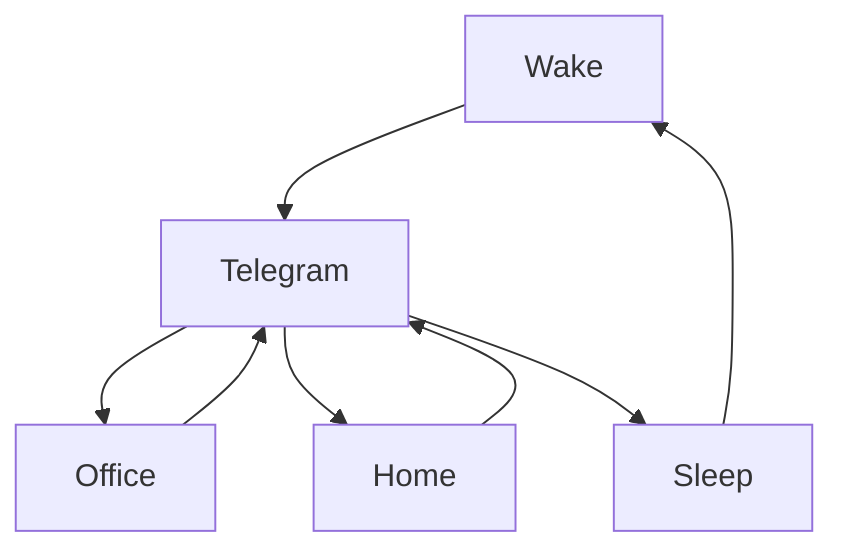

### 🎬 1tamilmv RSS Feed

<!-- BLOG-POST-LIST:START -->
- [KGF Vol 1 &amp; Vol 2 &lpar;Original Background Score&rpar; Soundtracks And BGM&#39;s [2019-CDQ]](https://www.1tamilmv.cloud/index.php?/forums/topic/164320-kgf-vol-1-vol-2-original-background-score-soundtracks-and-bgms-2019-cdq/&do=findComment&comment=328704)
- [Doctor Strange in the Multiverse of Madness &lpar;2022&rpar; &lpar;HD + DD5.1 Original Auds&rpar; - [1080p &amp; 720p - x264 - [Tamil + Telugu + Hindi + Malayalam + Kannada + Eng] - 23GB - 8.1GB - 3.2GB - 1.8GB &amp; 900MB] - [x264 - &lpar;MULTI&rpar; - 700MB - 450MB &amp; 250MB] - ESub](https://www.1tamilmv.cloud/index.php?/forums/topic/164300-doctor-strange-in-the-multiverse-of-madness-2022-hd-dd51-original-auds-1080p-720p-x264-tamil-telugu-hindi-malayalam-kannada-eng-23gb-81gb-32gb-18gb-900mb-x264-multi-700mb-450mb-250mb-esub/&do=findComment&comment=328703)
- [Ms. Marvel &lpar;2022&rpar; S01 EP03 TRUE WEB-DL - [1080p &amp; 720p - x264 - &lpar;DD+5.1 - 192Kbps&rpar; [Tamil + Telugu + Hindi + Malayalam + Eng] - 1GB - 500MB &amp; 200MB] - ESub](https://www.1tamilmv.cloud/index.php?/forums/topic/164307-ms-marvel-2022-s01-ep03-true-web-dl-1080p-720p-x264-dd51-192kbps-tamil-telugu-hindi-malayalam-eng-1gb-500mb-200mb-esub/&do=findComment&comment=328702)
- [Doctor Strange in the Multiverse of Madness &lpar;2022&rpar; &lpar;HD + DD5.1 Original Auds&rpar; - [1080p &amp; 720p - x264 - [Tamil + Telugu + Hindi + Malayalam + Kannada + Eng] - 23GB - 8.1GB - 3.2GB - 1.8GB &amp; 900MB] - [x264 - &lpar;MULTI&rpar; - 700MB - 450MB &amp; 250MB] - ESub](https://www.1tamilmv.cloud/index.php?/forums/topic/164300-doctor-strange-in-the-multiverse-of-madness-2022-hd-dd51-original-auds-1080p-720p-x264-tamil-telugu-hindi-malayalam-kannada-eng-23gb-81gb-32gb-18gb-900mb-x264-multi-700mb-450mb-250mb-esub/&do=findComment&comment=328701)
- [༒ Doctor Strange in the Multiverse of Madness &lpar;2022&rpar; HD Original Auds - [1080p &amp; 720p - x264 - [Tamil + Telugu + Hindi + Malayalam + Kannada + Eng] - 18GB - 4GB - 1.8GB &amp; 900MB] - 700MB - 450MB &amp; 250MB] - ESub - Google Drive](https://www.1tamilmv.cloud/index.php?/forums/topic/164319-%E0%BC%92-doctor-strange-in-the-multiverse-of-madness-2022-hd-original-auds-1080p-720p-x264-tamil-telugu-hindi-malayalam-kannada-eng-18gb-4gb-18gb-900mb-700mb-450mb-250mb-esub-google-drive/&do=findComment&comment=328700)
<!-- BLOG-POST-LIST:END -->

# =====Spotify Playlist=====

 

 
<h3 align="center">  </h3>
 

<H1>My Routine</H1>

 

    
    
    

