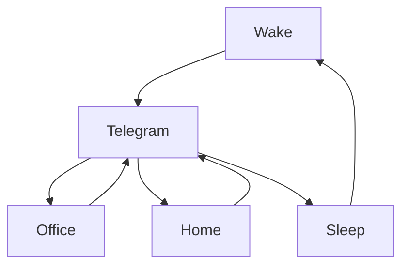

### 🎬 1tamilmv RSS Feed

<!-- BLOG-POST-LIST:START -->
- [Doctor Strange in the Multiverse of Madness &lpar;2022&rpar; Multi Auds[Tel + Tam + Kan + Mal + Hin + Eng] - [4K|2K|1080P] - HEVC - [AC3&lpar;DD+5.1&rpar; + AAC&lpar;5.1&rpar;] - [192 + 128Kbps] - ESubs - [7.85GB|4.65GB|3.63|1.9GB] - [DSM]](https://www.1tamilmv.cloud/index.php?/forums/topic/164316-doctor-strange-in-the-multiverse-of-madness-2022-multi-audstel-tam-kan-mal-hin-eng-4k2k1080p-hevc-ac3dd51-aac51-192-128kbps-esubs-785gb465gb36319gb-dsm/&do=findComment&comment=328694)
- [Obi-Wan.Kenobi.S01.Complete.DUAL.AUDIO.TAM-ENG.WEBRip.6CH.x265.HEVC-THH - 1080p | 720p - 3.22 GB | 1.27 GB](https://www.1tamilmv.cloud/index.php?/forums/topic/164315-obi-wankenobis01completedualaudiotam-engwebrip6chx265hevc-thh-1080p-720p-322-gb-127-gb/&do=findComment&comment=328693)
- [BEAST &lpar;2022&rpar; [Original Background Score] [ALAC &amp; FLAC] [24Bit/16Bit] iTunes HQ MP3 [320Kbps &amp; 128Kbps] - Anirudh Ravichandar Musical](https://www.1tamilmv.cloud/index.php?/forums/topic/164293-beast-2022-original-background-score-alac-flac-24bit16bit-itunes-hq-mp3-320kbps-128kbps-anirudh-ravichandar-musical/&do=findComment&comment=328692)
- [Doctor Strange in the Multiverse of Madness &lpar;2022&rpar; DSNP WEB-DL [Telugu + Tamil + Hindi + Malayalam + Kannada + English] | 4K, 1080p, 720p - 9.7GB - 3.9GB - 2GB | DD5.1 - Esub [GDRIVE]](https://www.1tamilmv.cloud/index.php?/forums/topic/164314-doctor-strange-in-the-multiverse-of-madness-2022-dsnp-web-dl-telugu-tamil-hindi-malayalam-kannada-english-4k-1080p-720p-97gb-39gb-2gb-dd51-esub-gdrive/&do=findComment&comment=328691)
- [Ms.Marvel.S01E03.DSNP.WEB-DL.Multi.DDP5.1.Esubs - 2160p [4K] | 1080p | 720p - 3.56 GB | 1.51 GB | 910 MB](https://www.1tamilmv.cloud/index.php?/forums/topic/164313-msmarvels01e03dsnpweb-dlmultiddp51esubs-2160p-4k-1080p-720p-356-gb-151-gb-910-mb/&do=findComment&comment=328690)
<!-- BLOG-POST-LIST:END -->

# =====Spotify Playlist=====

 

 
<h3 align="center">  </h3>
 

<H1>My Routine</H1>

 

    
    
    

