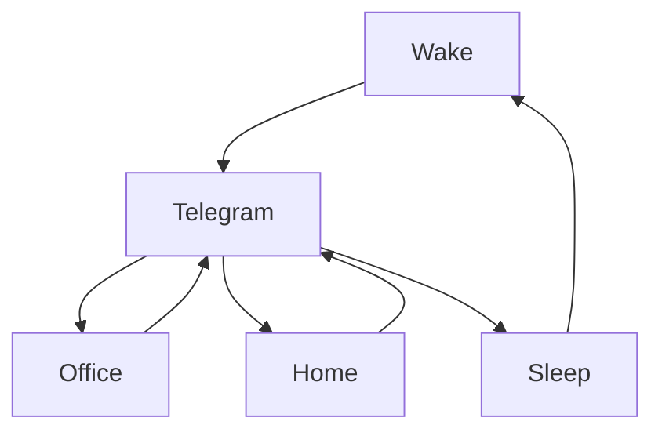

***
# Ravana Github Readme 
***

### 🎬 1tamilmv RSS Feed

<!-- BLOG-POST-LIST:START -->
- [Spider-Man &lpar;2002&rpar; BluRay Multi 5.1 ESubs - 2160p [HDR] | 1080p | 720p - 22.1 GB | 12.6 GB | 8.4 GB | 4.3 GB | 1.3 GB](https://www.1tamilmv.team/index.php?/forums/topic/167660-spider-man-2002-bluray-multi-51-esubs-2160p-hdr-1080p-720p-221-gb-126-gb-84-gb-43-gb-13-gb/&do=findComment&comment=333897)
- [Peranbu &lpar;2019&rpar; AMZN - WEB-DL - 1080p - Tamil - DDP5.1 - H.264 - 7GB - ESub](https://www.1tamilmv.team/index.php?/forums/topic/167689-peranbu-2019-amzn-web-dl-1080p-tamil-ddp51-h264-7gb-esub/&do=findComment&comment=333896)
- [Jilla &lpar;2014&rpar; Tamil TRUE HD - AVC / DD5.1 / DD5.1 / DDP5.1  - x264/x265 - HEVC - [#2160p #4K - 14.7GB] - [#1080P - 11.3GB - 9.4GB - 7.6 GB - 6.4GB - 2GB - 1.3GB - 1.1GB - 950MB] - [#720p - 1.4GB - 1GB - 980MB - 700MB] - Google Drive](https://www.1tamilmv.team/index.php?/forums/topic/167688-jilla-2014-tamil-true-hd-avc-dd51-dd51-ddp51-x264x265-hevc-2160p-4k-147gb-1080p-113gb-94gb-76-gb-64gb-2gb-13gb-11gb-950mb-720p-14gb-1gb-980mb-700mb-google-drive/&do=findComment&comment=333895)
- [Marina &lpar;2012&rpar; Tamil 1080p HS - WEB-DL - x264 - DD5.1&lpar;384Kbps&rpar;+ AAC - 4.3GB.mkv G - DRIVE](https://www.1tamilmv.team/index.php?/forums/topic/167687-marina-2012-tamil-1080p-hs-web-dl-x264-dd51384kbps-aac-43gbmkv-g-drive/&do=findComment&comment=333894)
- [Thani_Oruvan_2015_Tamil_ITunes_720p_HDRip_AC3.mkv 1.5 GB G- DRIVE](https://www.1tamilmv.team/index.php?/forums/topic/167686-thani_oruvan_2015_tamil_itunes_720p_hdrip_ac3mkv-15-gb-g-drive/&do=findComment&comment=333893)
<!-- BLOG-POST-LIST:END -->

# =====Spotify Playlist=====

 

 
<h3 align="center">  </h3>
 

<H1>My Routine</H1>

 

    
    
    

         

# Humans

# Bike N Angel

# Hypnotic Loop

https://user-images.githubusercontent.com/47528708/176845771-6ad8f1d2-8008-4f49-ac35-5ebb89644732.mp4

