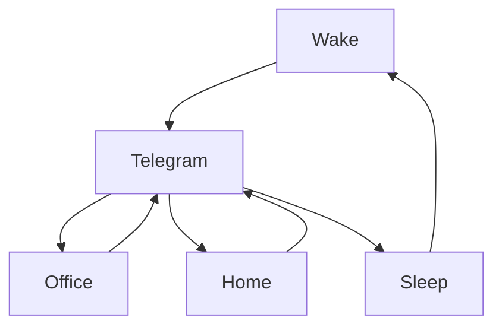

### 🎬 1tamilmv RSS Feed

<!-- BLOG-POST-LIST:START -->
- [Avengers Quadrilogy &lpar;2012-2019&rpar; Blu-Ray - &lpar;Original Audios&rpar; - &lpar;Telugu + Tamil + Hindi + English&rpar; - 720p - x264 - AAC - ESubs](https://www.1tamilmv.click/index.php?/forums/topic/166236-avengers-quadrilogy-2012-2019-blu-ray-original-audios-telugu-tamil-hindi-english-720p-x264-aac-esubs/&do=findComment&comment=331854)
- [Doraemon: Nobita and the Island of Miracles ~Animal Adventure~ &lpar;2012&rpar; BluRay Multi Audio [Hindi-Tamil-Telugu-Jap] 480p, 720p &amp; 1080p HD | 10bit HEVC ESub](https://www.1tamilmv.click/index.php?/forums/topic/166235-doraemon-nobita-and-the-island-of-miracles-~animal-adventure~-2012-bluray-multi-audio-hindi-tamil-telugu-jap-480p-720p-1080p-hd-10bit-hevc-esub/&do=findComment&comment=331853)
- [Vallavan &lpar;2006&rpar; Tamil TRUE WEB DL - UNCUT VERSION](https://www.1tamilmv.click/index.php?/forums/topic/166234-vallavan-2006-tamil-true-web-dl-uncut-version/&do=findComment&comment=331852)
- [Ellame Jolly Dhaan &lpar;From &quot;Kanaa Kaanum Kalangal&quot;&rpar; - G.V. Prakash Kumar - FLAC [24bit &lpar;96kHz|48kHz&rpar;|16bit]  | MP3 [320kbps|128kbps] - 76 MB | 48 MB | 25 MB | 9 MB | 4 MB](https://www.1tamilmv.click/index.php?/forums/topic/166233-ellame-jolly-dhaan-from-kanaa-kaanum-kalangal-gv-prakash-kumar-flac-24bit-96khz48khz16bit-mp3-320kbps128kbps-76-mb-48-mb-25-mb-9-mb-4-mb/&do=findComment&comment=331851)
- [🔰Jurassic World Dominion &lpar;2022&rpar; - ENGLISH -[4K - ULTRAHD] - &lpar;2160p&rpar; - [10BIT - HDR - WEB-HD] - &lpar;6CH x264 - DD+5.1 - 640Kbps &amp; AAC 2.0&rpar; -HEVC - DV - &lpar;4.84GB&rpar; - ESUB - &lpar;GOOGLE DRIVE LINK&rpar;🔰](https://www.1tamilmv.click/index.php?/forums/topic/166232-%F0%9F%94%B0jurassic-world-dominion-2022-english-4k-ultrahd-2160p-10bit-hdr-web-hd-6ch-x264-dd51-640kbps-aac-20-hevc-dv-484gb-esub-google-drive-link%F0%9F%94%B0/&do=findComment&comment=331850)
<!-- BLOG-POST-LIST:END -->

# =====Spotify Playlist=====

 

 
<h3 align="center">  </h3>
 

<H1>My Routine</H1>

 

    
    
    

        

# Humans

# Bike N Angel

# Hypnotic Loop

https://user-images.githubusercontent.com/47528708/176845771-6ad8f1d2-8008-4f49-ac35-5ebb89644732.mp4

