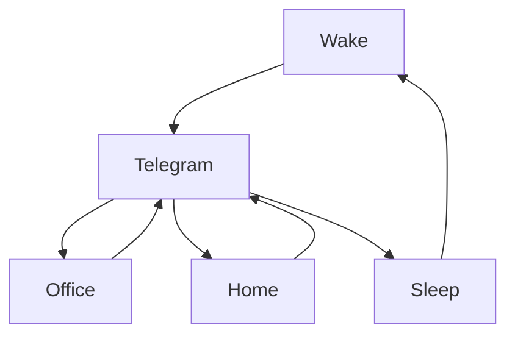

### 🎬 1tamilmv RSS Feed

<!-- BLOG-POST-LIST:START -->
- [Tomorrow &lpar;July 1&rpar; OTT Release Movies &amp; Theatrical Release Movies List | Television Premiere Movies](https://www.1tamilmv.space/index.php?/forums/topic/164780-tomorrow-july-1-ott-release-movies-theatrical-release-movies-list-television-premiere-movies/&do=findComment&comment=329405)
- [Pellamtho Panenti &lpar;2003&rpar; Telugu JC TRUE WEB-DL &amp; HDRips - [1080p-5GB-2.5GB / 720p-1.4GB / 576p-6GB-700MB / 480p-400MB] - AVC - AAC - [GDriveLinks]](https://www.1tamilmv.space/index.php?/forums/topic/164768-pellamtho-panenti-2003-telugu-jc-true-web-dl-hdrips-1080p-5gb-25gb-720p-14gb-576p-6gb-700mb-480p-400mb-avc-aac-gdrivelinks/&do=findComment&comment=329404)
- [Sherwood Season 01 All Episodes 720p 10bit x265 HEVC](https://www.1tamilmv.space/index.php?/forums/topic/164779-sherwood-season-01-all-episodes-720p-10bit-x265-hevc/&do=findComment&comment=329403)
- [Yours Abhi &lpar;2004&rpar; Telugu JC WEB-DL &amp; HDRips - [1080p-5GB-2.5GB / 720p-1.4GB / 576p-5.5GB-700MB / 480p-400MB] - AVC - AAC - [GDriveLinks]](https://www.1tamilmv.space/index.php?/forums/topic/164778-yours-abhi-2004-telugu-jc-web-dl-hdrips-1080p-5gb-25gb-720p-14gb-576p-55gb-700mb-480p-400mb-avc-aac-gdrivelinks/&do=findComment&comment=329402)
- [Vaana &lpar;2008&rpar; Telugu ZEE5 WEB-DL - [1080p-3GB / 720p-2.5GB / 576p-1.3GB / 480p-850MB / 360p-650MB / 240p-350MB] - AVC - AAC - [GDriveLinks]](https://www.1tamilmv.space/index.php?/forums/topic/164777-vaana-2008-telugu-zee5-web-dl-1080p-3gb-720p-25gb-576p-13gb-480p-850mb-360p-650mb-240p-350mb-avc-aac-gdrivelinks/&do=findComment&comment=329401)
<!-- BLOG-POST-LIST:END -->

# =====Spotify Playlist=====

 

 
<h3 align="center">  </h3>
 

<H1>My Routine</H1>

 

    
    
    

     

# Humans

# Bike N Angel

