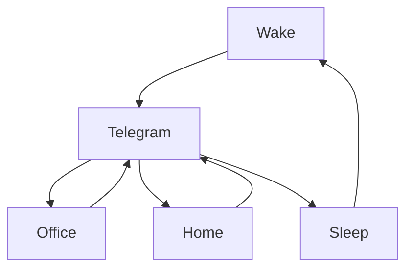

### 🎬 1tamilmv RSS Feed

<!-- BLOG-POST-LIST:START -->
- [@Benzmovies - Rangasthalam &lpar;2018&rpar; Telugu [1080p TRUE HD AVC x264 UNTOUCHED AAC &amp; DDP5.1 - 8.5GB Esub] Benz.mkv 8.5GB](https://www.1tamilmv.space/index.php?/forums/topic/164673-benzmovies-rangasthalam-2018-telugu-1080p-true-hd-avc-x264-untouched-aac-ddp51-85gb-esub-benzmkv-85gb/&do=findComment&comment=329231)
- [@Benzmovies - Adhurs &lpar;2010&rpar; 1080p BluRay x264 DTS 5.1 Benz.mkv](https://www.1tamilmv.space/index.php?/forums/topic/164672-benzmovies-adhurs-2010-1080p-bluray-x264-dts-51-benzmkv/&do=findComment&comment=329230)
- [Anek &lpar;2022&rpar; Hindi TRUE WEB-DL - [1080p &amp; 720p - AVC - &lpar;DD+5.1 - 640Kbps&rpar; - 5GB - 2.5GB - 1.4GB] - [x264 - 700MB &amp; 400MB] - ESub](https://www.1tamilmv.space/index.php?/forums/topic/164547-anek-2022-hindi-true-web-dl-1080p-720p-avc-dd51-640kbps-5gb-25gb-14gb-x264-700mb-400mb-esub/&do=findComment&comment=329229)
- [@Benzmovies - Avatar &lpar;2009&rpar; [2160p - Extended - HEVC - x265 - [Tamil + Telugu + Hindi + Eng] - 19.1GB - ESubs] Benz.mkv 19.2GB](https://www.1tamilmv.space/index.php?/forums/topic/164671-benzmovies-avatar-2009-2160p-extended-hevc-x265-tamil-telugu-hindi-eng-191gb-esubs-benzmkv-192gb/&do=findComment&comment=329228)
- [@MoviesHola - Logan &lpar;2017&rpar; BluRay - 1080p - Multi Auds [Tamil + Telugu + Hindi] DD5.1 &lpar;448Kbps&rpar; + [English DTS 5.1 &lpar;1509Kbps&rpar;] - H.264 - 7.5GB - MSub.mkv](https://www.1tamilmv.space/index.php?/forums/topic/164670-movieshola-logan-2017-bluray-1080p-multi-auds-tamil-telugu-hindi-dd51-448kbps-english-dts-51-1509kbps-h264-75gb-msubmkv/&do=findComment&comment=329227)
<!-- BLOG-POST-LIST:END -->

# =====Spotify Playlist=====

 

 
<h3 align="center">  </h3>
 

<H1>My Routine</H1>

 

    
    
    

           

# Humans

       

