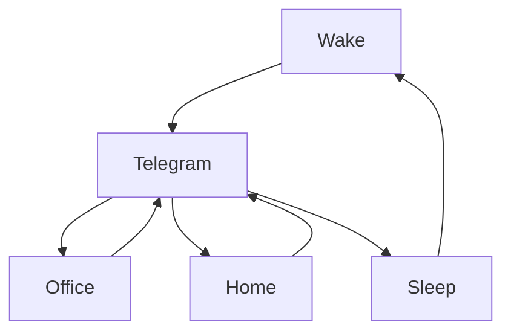

### 🎬 1tamilmv RSS Feed

<!-- BLOG-POST-LIST:START -->
- [Panni Kutty &lpar;2022&rpar; Tamil Proper TRUE WEB-DL - [1080p &amp; 720p - HEVC / AVC - &lpar;DD+5.1 - 192Kbps&rpar; - 4.4GB - 2.3GB - 1.4GB &amp; 800MB] - [x264 - 700MB - 400MB &amp; 250MB]](https://www.1tamilmv.team/index.php?/forums/topic/167369-panni-kutty-2022-tamil-proper-true-web-dl-1080p-720p-hevc-avc-dd51-192kbps-44gb-23gb-14gb-800mb-x264-700mb-400mb-250mb/&do=findComment&comment=333466)
- [Kaaneyadavara Bagge Prakatane &lpar;2022&rpar; Kannada TRUE WEB-DL - [1080p &amp; 720p - AVC - 2.4GB &amp; 1.3GB] - [x264 - 700MB &amp; 400MB]](https://www.1tamilmv.team/index.php?/forums/topic/167367-kaaneyadavara-bagge-prakatane-2022-kannada-true-web-dl-1080p-720p-avc-24gb-13gb-x264-700mb-400mb/&do=findComment&comment=333464)
- [The Incredible Hulk &lpar;2008&rpar; BluRay Original Audios - &lpar;Tamil + Telugu + Hindi + English&rpar; - AVC x264 / DD5.1 - [#2160p #4K - 5.4GB] - [#1080p - 2.3GB - 2GB - 1.8GB] - [#720p - 900MB] - ESubs](https://www.1tamilmv.team/index.php?/forums/topic/167366-the-incredible-hulk-2008-bluray-original-audios-tamil-telugu-hindi-english-avc-x264-dd51-2160p-4k-54gb-1080p-23gb-2gb-18gb-720p-900mb-esubs/&do=findComment&comment=333463)
- [Iron Man &lpar;2008&rpar; BluRay Original Audios - &lpar;Tamil + Telugu + Hindi + English&rpar; - AVC x264 / DD5.1 - [#2160p #4K - 21GB - 18GB - 16GB - 4.2GB] - [#1080p - 8GB - 7.2GB - 6.3GB - 4.3GB - 2.7GB - 2.5GB] - [#720p - 4.3GB - 1.1GB - 1GB] - MSubs](https://www.1tamilmv.team/index.php?/forums/topic/167362-iron-man-2008-bluray-original-audios-tamil-telugu-hindi-english-avc-x264-dd51-2160p-4k-21gb-18gb-16gb-42gb-1080p-8gb-72gb-63gb-43gb-27gb-25gb-720p-43gb-11gb-1gb-msubs/&do=findComment&comment=333459)
- [Aathi &lpar;2006&rpar; Tamil AMZN WEB-DL HD - [1080P - 10.8GB - 10.6GB - 6.2GB] - [720p - 6GB - 3.6GB 3.2GB 1.4GB] - MSLeyon - Google Drive](https://www.1tamilmv.team/index.php?/forums/topic/167360-aathi-2006-tamil-amzn-web-dl-hd-1080p-108gb-106gb-62gb-720p-6gb-36gb-32gb-14gb-msleyon-google-drive/&do=findComment&comment=333457)
<!-- BLOG-POST-LIST:END -->

# =====Spotify Playlist=====

 

 
<h3 align="center">  </h3>
 

<H1>My Routine</H1>

 

    
    
    

        

# Humans

# Bike N Angel

# Hypnotic Loop

https://user-images.githubusercontent.com/47528708/176845771-6ad8f1d2-8008-4f49-ac35-5ebb89644732.mp4

