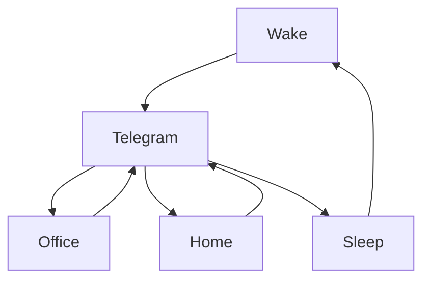

### 🎬 1tamilmv RSS Feed

<!-- BLOG-POST-LIST:START -->
- [Meda Meeda Abbayi &lpar;2017&rpar; Telugu JC WEB-DL - [1080p-7GB-3.8GB / 720p-1.1GB / 480p-800MB / 360p-600MB / 240p-400MB] - AVC - DD+5.1 - 192kbps &amp; AAC - Esubs - [GDrive]](https://www.1tamilmv.cloud/index.php?/forums/topic/164329-meda-meeda-abbayi-2017-telugu-jc-web-dl-1080p-7gb-38gb-720p-11gb-480p-800mb-360p-600mb-240p-400mb-avc-dd51-192kbps-aac-esubs-gdrive/&do=findComment&comment=328722)
- [Nenjuku Needhi &lpar;2022&rpar; Proper TRUE WEB-DL - [1080p &amp; 720p - AVC - &lpar;AAC 2.0 - 96Kbps&rpar; [Tamil + Telugu + Malayalam + Kannada] - 3.1GB - 1.4GB &amp; 950MB] - [x264 - &lpar;MULTI&rpar; - 800MB - 500MB &amp; 300MB] - ESub](https://www.1tamilmv.cloud/index.php?/forums/topic/164325-nenjuku-needhi-2022-proper-true-web-dl-1080p-720p-avc-aac-20-96kbps-tamil-telugu-malayalam-kannada-31gb-14gb-950mb-x264-multi-800mb-500mb-300mb-esub/&do=findComment&comment=328721)
- [Nenjuku Needhi &lpar;2022&rpar; Proper TRUE WEB-DL - [1080p &amp; 720p - AVC - &lpar;AAC 2.0 - 96Kbps&rpar; [Tamil + Telugu + Malayalam + Kannada] - 3.1GB - 1.4GB &amp; 950MB] - [x264 - &lpar;MULTI&rpar; - 800MB - 500MB &amp; 300MB] - ESub](https://www.1tamilmv.cloud/index.php?/forums/topic/164325-nenjuku-needhi-2022-proper-true-web-dl-1080p-720p-avc-aac-20-96kbps-tamil-telugu-malayalam-kannada-31gb-14gb-950mb-x264-multi-800mb-500mb-300mb-esub/&do=findComment&comment=328720)
- [Meda Meeda Abbayi &lpar;2017&rpar; Telugu JC WEB-DL - [1080p-7GB-3.8GB / 720p-1.1GB / 480p-800MB / 360p-600MB / 240p-400MB] - AVC - DD+5.1 - 192kbps &amp; AAC - Esubs - [GDrive]](https://www.1tamilmv.cloud/index.php?/forums/topic/164329-meda-meeda-abbayi-2017-telugu-jc-web-dl-1080p-7gb-38gb-720p-11gb-480p-800mb-360p-600mb-240p-400mb-avc-dd51-192kbps-aac-esubs-gdrive/&do=findComment&comment=328719)
- [Manoharam &lpar;2000&rpar; Telugu JC TRUE WEBDL &amp; HDRips - [1080p-5GB-2.5GB / 720p-1.6GB / 576p-6.5GB-700MB / 480p-400MB] - AVC - AAC - [GDrive]](https://www.1tamilmv.cloud/index.php?/forums/topic/164328-manoharam-2000-telugu-jc-true-webdl-hdrips-1080p-5gb-25gb-720p-16gb-576p-65gb-700mb-480p-400mb-avc-aac-gdrive/&do=findComment&comment=328718)
<!-- BLOG-POST-LIST:END -->

# =====Spotify Playlist=====

 

 
<h3 align="center">  </h3>
 

<H1>My Routine</H1>

 

    
    
    

