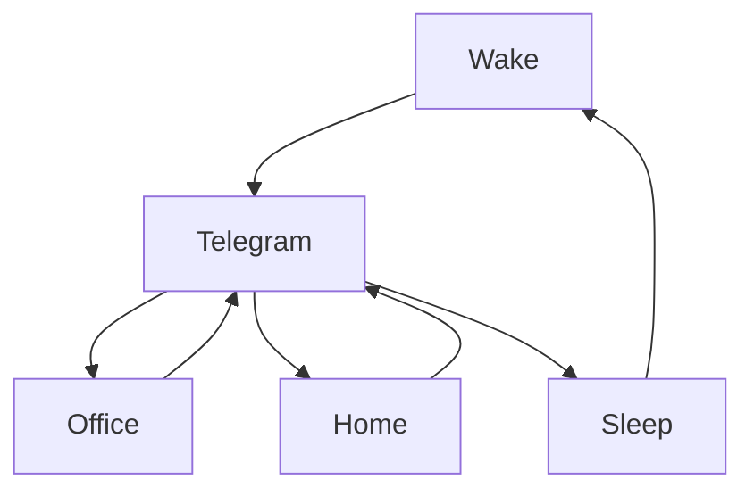

### 🎬 1tamilmv RSS Feed

<!-- BLOG-POST-LIST:START -->
- [Jadaghatta &lpar;2022&rpar; Kannada TRUE WEB-DL - [720p - HD AVC - 1.3GB] - [x264 - 700MB &amp; 400MB] - HC-ESub](https://www.1tamilmv.space/index.php?/forums/topic/164644-jadaghatta-2022-kannada-true-web-dl-720p-hd-avc-13gb-x264-700mb-400mb-hc-esub/&do=findComment&comment=329201)
- [Indian &lpar;1996&rpar; [ Tamil - 1080p - AVC - UNTOUCHED - AAC2.0 - x264 - 3.7GB]](https://www.1tamilmv.space/index.php?/forums/topic/164279-indian-1996-tamil-1080p-avc-untouched-aac20-x264-37gb/&do=findComment&comment=329200)
- [10 Malayalam Movies - 1080p - DNP / SUN NXT WEBDL - H.264 / H.265 - DD5.1 / AAC5.1 / AAC2.0 - ESub - 30GB [GDrive]](https://www.1tamilmv.space/index.php?/forums/topic/164654-10-malayalam-movies-1080p-dnp-sun-nxt-webdl-h264-h265-dd51-aac51-aac20-esub-30gb-gdrive/&do=findComment&comment=329199)
- [50 Tamil Movies - 1080p - AMZN / ZEE5 / SS / JC / TK WEB DL - DD5.1 / AAC5.1 / AAC2.0 - ESub - 70GB [GDrive]](https://www.1tamilmv.space/index.php?/forums/topic/164653-50-tamil-movies-1080p-amzn-zee5-ss-jc-tk-web-dl-dd51-aac51-aac20-esub-70gb-gdrive/&do=findComment&comment=329198)
- [Jadaghatta &lpar;2022&rpar; Kannada TRUE WEB-DL - [720p - HD AVC - 1.3GB] - [x264 - 700MB &amp; 400MB] - HC-ESub](https://www.1tamilmv.space/index.php?/forums/topic/164644-jadaghatta-2022-kannada-true-web-dl-720p-hd-avc-13gb-x264-700mb-400mb-hc-esub/&do=findComment&comment=329197)
<!-- BLOG-POST-LIST:END -->

# =====Spotify Playlist=====

 

 
<h3 align="center">  </h3>
 

<H1>My Routine</H1>

 

    
    
    

           

