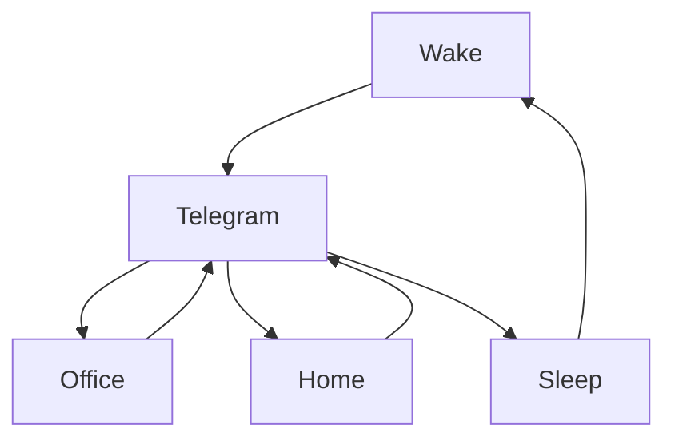

### 🎬 1tamilmv RSS Feed

<!-- BLOG-POST-LIST:START -->
- [Virata Parvam &lpar;2022&rpar; Telugu TRUE WEB-DL - [1080p &amp; 720p - HEVC / AVC - 6.8GB - 3.8GB - 2.9GB - 1.4GB &amp; 950MB] - [x264 - 700MB - 400MB &amp; 250MB] - ESub](https://www.1tamilmv.space/index.php?/forums/topic/164784-virata-parvam-2022-telugu-true-web-dl-1080p-720p-hevc-avc-68gb-38gb-29gb-14gb-950mb-x264-700mb-400mb-250mb-esub/&do=findComment&comment=329853)
- [[GDrive] Guilty Minds &lpar;2022&rpar; S01 EP&lpar;01-10&rpar; - 1080p HQ HDRip - x264 - [Tamil + Telugu + Hindi] - &lpar;DD5.1 - 192Kbps&rpar; - 6.4GB 3 GB 1.9GB- ESubs].](https://www.1tamilmv.space/index.php?/forums/topic/165040-gdrive-guilty-minds-2022-s01-ep01-10-1080p-hq-hdrip-x264-tamil-telugu-hindi-dd51-192kbps-64gb-3-gb-19gb-esubs/&do=findComment&comment=329852)
- [SAMAR 2013 - ALAGO ALAHU VIDEO SONG HD1080P WITH 5.1 DTS..](https://www.1tamilmv.space/index.php?/forums/topic/165039-samar-2013-alago-alahu-video-song-hd1080p-with-51-dts/&do=findComment&comment=329851)
- [༒    The King Maker &lpar;2005&rpar; &lpar;BluRay + Original Audio&rpar; - [1080p &amp; 720p - x264 - &lpar;Tamil + Eng&rpar; - 1.6GB &amp; 850MB | x264 - &lpar;Tamil&rpar; - 400MB] - Google Drive](https://www.1tamilmv.space/index.php?/forums/topic/165038-%E0%BC%92-the-king-maker-2005-bluray-original-audio-1080p-720p-x264-tamil-eng-16gb-850mb-x264-tamil-400mb-google-drive/&do=findComment&comment=329850)
- [Transformers &lpar;2007&rpar; Multi Auds[Tel + Tam + Hin + Ben + Mar + Eng] BluRay [4K|1080P|720P] HEVC AC3&lpar;DD+5.1&rpar; [15.5GB - 12.6GB - 10GB - 7.6GB - 5.6GB - 3.8GB - 2GB - 1GB - 600MB]ESubs](https://www.1tamilmv.space/index.php?/forums/topic/165037-transformers-2007-multi-audstel-tam-hin-ben-mar-eng-bluray-4k1080p720p-hevc-ac3dd51-155gb-126gb-10gb-76gb-56gb-38gb-2gb-1gb-600mbesubs/&do=findComment&comment=329849)
<!-- BLOG-POST-LIST:END -->

# =====Spotify Playlist=====

 

 
<h3 align="center">  </h3>
 

<H1>My Routine</H1>

 

    
    
    

     

# Humans

# Bike N Angel

# Hypnotic Loop

https://user-images.githubusercontent.com/47528708/176845771-6ad8f1d2-8008-4f49-ac35-5ebb89644732.mp4

