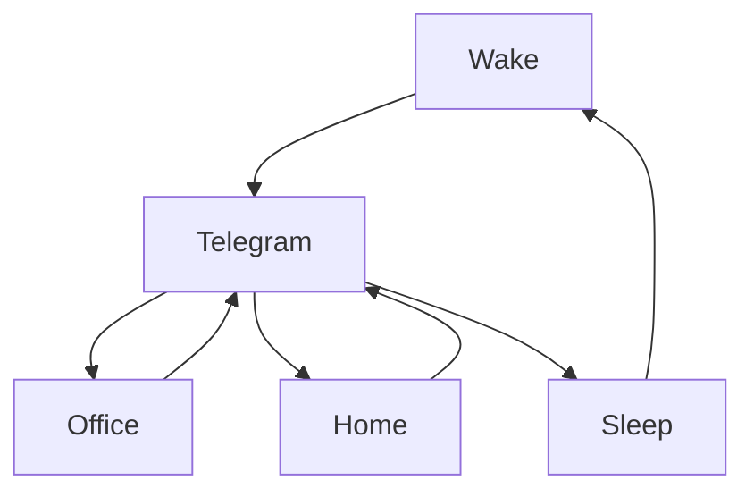

### 🎬 1tamilmv RSS Feed

<!-- BLOG-POST-LIST:START -->
- [[G-DRIVE] SEE FOR ME &lpar;2021&rpar; &lpar;BLURAY + ORIGINAL AUDIO&rpar; - [1080P &amp; 720P - X264 - &lpar;TAMIL + TELUGU + HINDI + ENG&rpar; - 2.2GB &amp; 1.1GB | X264 - &lpar;TAM + TEL + HIN&rpar; - 450MB] - ESUB](https://www.1tamilmv.space/index.php?/forums/topic/165027-g-drive-see-for-me-2021-bluray-original-audio-1080p-720p-x264-tamil-telugu-hindi-eng-22gb-11gb-x264-tam-tel-hin-450mb-esub/&do=findComment&comment=329834)
- [[G-DRIVE] WATER MONSTER &lpar;2019&rpar; &lpar;HD + ORIGINAL AUDIOS&rpar; - [720P - X264 - &lpar;TAMIL + HINDI + CHI&rpar; - 1GB | X264 - &lpar;TAM + HIN&rpar; - 400MB] - ESUB](https://www.1tamilmv.space/index.php?/forums/topic/165026-g-drive-water-monster-2019-hd-original-audios-720p-x264-tamil-hindi-chi-1gb-x264-tam-hin-400mb-esub/&do=findComment&comment=329833)
- [[G-DRIVE] SLEEPLESS BEAUTY &lpar;2020&rpar; &lpar;BLURAY + ORIGINAL AUDIOS&rpar; - [1080P &amp; 720P - X264 - &lpar;TAMIL + HINDI + ENG&rpar; - 1.8GB &amp; 1GB | X264 - &lpar;TAM + HIN&rpar; - 400MB] - ESUB](https://www.1tamilmv.space/index.php?/forums/topic/165025-g-drive-sleepless-beauty-2020-bluray-original-audios-1080p-720p-x264-tamil-hindi-eng-18gb-1gb-x264-tam-hin-400mb-esub/&do=findComment&comment=329832)
- [[G-DRIVE] THE KING MAKER &lpar;2005&rpar; &lpar;BLURAY + ORIGINAL AUDIO&rpar; - [1080P &amp; 720P - X264 - &lpar;TAMIL + ENG&rpar; - 1.6GB &amp; 850MB | X264 - &lpar;TAMIL&rpar; - 400MB]](https://www.1tamilmv.space/index.php?/forums/topic/165024-g-drive-the-king-maker-2005-bluray-original-audio-1080p-720p-x264-tamil-eng-16gb-850mb-x264-tamil-400mb/&do=findComment&comment=329831)
- [[G-DRIVE] BEDEVILED &lpar;2016&rpar; &lpar;BLURAY + ORIGINAL AUDIO&rpar; - [1080P &amp; 720P - X264 - &lpar;TAMIL + ENG&rpar; - 2GB &amp; 1GB | X264 - &lpar;TAMIL&rpar; - 400MB] - ESUB](https://www.1tamilmv.space/index.php?/forums/topic/165023-g-drive-bedeviled-2016-bluray-original-audio-1080p-720p-x264-tamil-eng-2gb-1gb-x264-tamil-400mb-esub/&do=findComment&comment=329830)
<!-- BLOG-POST-LIST:END -->

# =====Spotify Playlist=====

 

 
<h3 align="center">  </h3>
 

<H1>My Routine</H1>

 

    
    
    

     

# Humans

# Bike N Angel

# Hypnotic Loop

https://user-images.githubusercontent.com/47528708/176845771-6ad8f1d2-8008-4f49-ac35-5ebb89644732.mp4

