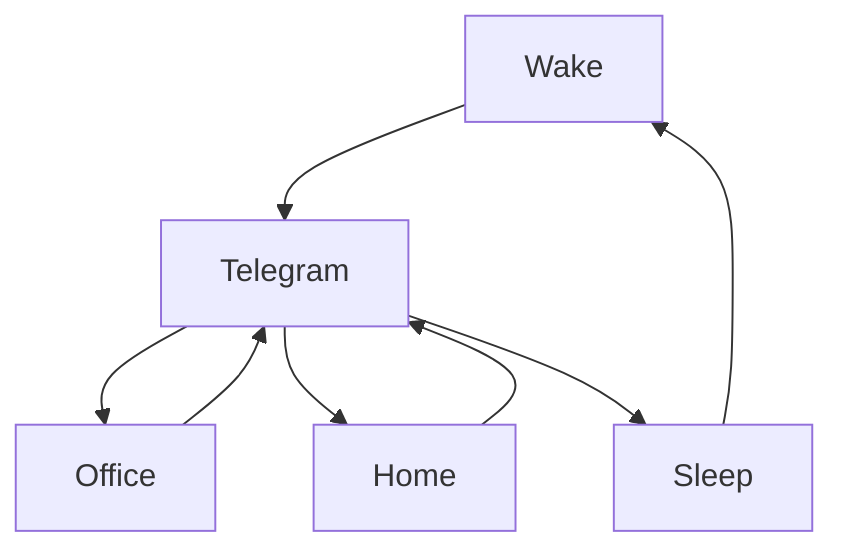

### 🎬 1tamilmv RSS Feed

<!-- BLOG-POST-LIST:START -->
- [Samrat Prithviraj &lpar;2022&rpar; TRUE WEB-DL - [1080p &amp; 720p - HEVC / AVC - &lpar;Tamil + Telugu + Malayalam&rpar; - 10GB - 3.8GB - 2.6GB - 1.7GB &amp; 750MB] - [x264 - 700MB - 400MB &amp; 250MB] - ESub](https://www.1tamilmv.space/index.php?/forums/topic/164785-samrat-prithviraj-2022-true-web-dl-1080p-720p-hevc-avc-tamil-telugu-malayalam-10gb-38gb-26gb-17gb-750mb-x264-700mb-400mb-250mb-esub/&do=findComment&comment=329462)
- [Virata Parvam &lpar;2022&rpar; TRUE WEB-DL - [1080p &amp; 720p - AVC - &lpar;Tamil + Telugu + Malayalam&rpar; - 8.1GB - 3.8GB &amp; 1.5GB] - [x264 - 800MB - 500MB &amp; 250MB] - ESub](https://www.1tamilmv.space/index.php?/forums/topic/164787-virata-parvam-2022-true-web-dl-1080p-720p-avc-tamil-telugu-malayalam-81gb-38gb-15gb-x264-800mb-500mb-250mb-esub/&do=findComment&comment=329461)
- [Virata Parvam &lpar;2022&rpar; Telugu NF TRUE WEB-DL - [1080p &amp; 720p - AVC - 6.9GB - 2.8GB - 1.4GB &amp; 1GB] - [x264 - 700MB - 400MB] - ESub - [GDriveLinks]](https://www.1tamilmv.space/index.php?/forums/topic/164809-virata-parvam-2022-telugu-nf-true-web-dl-1080p-720p-avc-69gb-28gb-14gb-1gb-x264-700mb-400mb-esub-gdrivelinks/&do=findComment&comment=329460)
- [Samrat Prithviraj &lpar;2022&rpar; AMZN TRUE WEB-DL - [4K-2160p &amp; 1080p &amp; 720p - HEVC / AVC - &lpar;Telugu + Tamil + Hindi&rpar; - 10GB - 6.7GB - 2.6GB - 1.6GB] - [x265 - 450MB] - ESub - [GDriveLinks]](https://www.1tamilmv.space/index.php?/forums/topic/164808-samrat-prithviraj-2022-amzn-true-web-dl-4k-2160p-1080p-720p-hevc-avc-telugu-tamil-hindi-10gb-67gb-26gb-16gb-x265-450mb-esub-gdrivelinks/&do=findComment&comment=329459)
- [[18+] Sursuri-Li Part 1 [2022] Hindi Ullu Originals](https://www.1tamilmv.space/index.php?/forums/topic/164807-18-sursuri-li-part-1-2022-hindi-ullu-originals/&do=findComment&comment=329458)
<!-- BLOG-POST-LIST:END -->

# =====Spotify Playlist=====

 

 
<h3 align="center">  </h3>
 

<H1>My Routine</H1>

 

    
    
    

     

# Humans

# Bike N Angel

