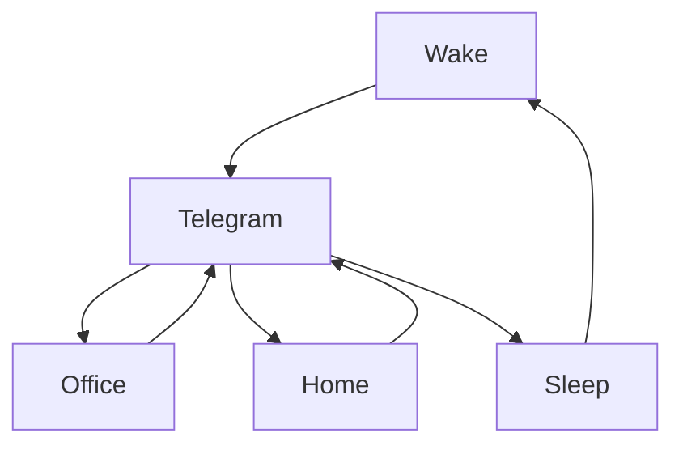

### 🎬 1tamilmv RSS Feed

<!-- BLOG-POST-LIST:START -->
- [@Benzmovies - Moon Knight Complete S01 [EP01 - EP06] 1080p DSNP WEB-DL x265 &lpar;DD+ 5.1 - 192Kbps&rpar; [Tel + Tam + Hin + Mal + Eng] MSub Benz.mkv 5.0GB](https://www.1tamilmv.click/index.php?/forums/topic/165540-benzmovies-moon-knight-complete-s01-ep01-ep06-1080p-dsnp-web-dl-x265-dd-51-192kbps-tel-tam-hin-mal-eng-msub-benzmkv-50gb/&do=findComment&comment=330740)
- [@Benzmovies - Moon Knight Complete S01 [EP01 - EP06] 720p DSNP WEB-DL x265 &lpar;AAC 2.0&rpar; [Tel + Tam + Hin + Mal + Eng] MSub Benz.mkv 2.3GB](https://www.1tamilmv.click/index.php?/forums/topic/165539-benzmovies-moon-knight-complete-s01-ep01-ep06-720p-dsnp-web-dl-x265-aac-20-tel-tam-hin-mal-eng-msub-benzmkv-23gb/&do=findComment&comment=330739)
- [@Benzmovies - Moon Knight Complete S01 [EP01 - EP06] 480p DSNP WEB-DL x265 &lpar;AAC 2.0&rpar; [Tel + Tam + Hin + Mal + Eng] MSub Benz.mkv 1.6GB](https://www.1tamilmv.click/index.php?/forums/topic/165538-benzmovies-moon-knight-complete-s01-ep01-ep06-480p-dsnp-web-dl-x265-aac-20-tel-tam-hin-mal-eng-msub-benzmkv-16gb/&do=findComment&comment=330738)
- [London Nahi Jaunga &lpar;2022&rpar; Hindi HQ PreDVD - [720p - x264 - 1.2GB | x264 - 700MB - 400MB] - HQ Clean Audio](https://www.1tamilmv.click/index.php?/forums/topic/165537-london-nahi-jaunga-2022-hindi-hq-predvd-720p-x264-12gb-x264-700mb-400mb-hq-clean-audio/&do=findComment&comment=330737)
- [Jurassic World Dominion &lpar;2022&rpar; English v2 Proper WEB-DL - [1080p &amp; 720p - x264 - &lpar;DD+5.1 - 640Kbps&rpar; - 2.7GB &amp; 1.1GB] - Soft ESub {𝐃𝐢𝐫𝐞𝐜𝐭 𝐋𝐢𝐧𝐤}](https://www.1tamilmv.click/index.php?/forums/topic/165536-jurassic-world-dominion-2022-english-v2-proper-web-dl-1080p-720p-x264-dd51-640kbps-27gb-11gb-soft-esub-%F0%9D%90%83%F0%9D%90%A2%F0%9D%90%AB%F0%9D%90%9E%F0%9D%90%9C%F0%9D%90%AD-%F0%9D%90%8B%F0%9D%90%A2%F0%9D%90%A7%F0%9D%90%A4/&do=findComment&comment=330736)
<!-- BLOG-POST-LIST:END -->

# =====Spotify Playlist=====

 

 
<h3 align="center">  </h3>
 

<H1>My Routine</H1>

 

    
    
    

     

# Humans

# Bike N Angel

# Hypnotic Loop

https://user-images.githubusercontent.com/47528708/176845771-6ad8f1d2-8008-4f49-ac35-5ebb89644732.mp4

