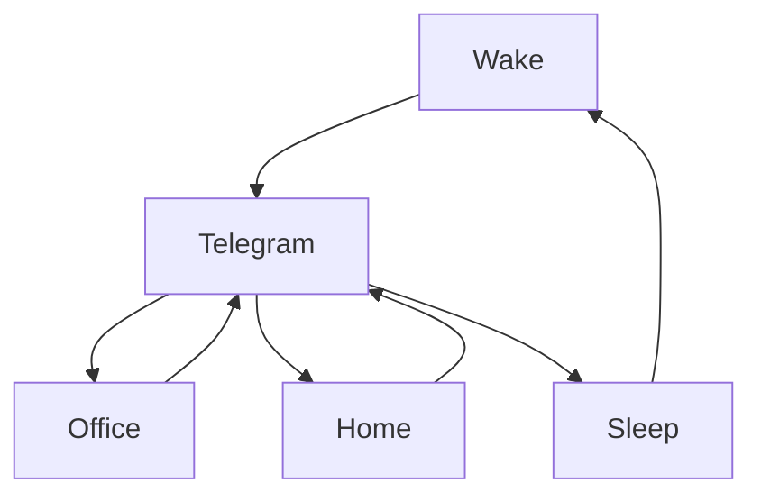

### 🎬 1tamilmv RSS Feed

<!-- BLOG-POST-LIST:START -->
- [Extraordinary You &lpar;2022&rpar; S01 EP &lpar;01-16&rpar; TRUE WEB-DL - [480p - [Hindi + Horean] - 3.2GB] - ESub {𝐆-𝐃𝐫𝐢𝐯𝐞}](https://www.1tamilmv.pics/index.php?/forums/topic/166690-extraordinary-you-2022-s01-ep-01-16-true-web-dl-480p-hindi-horean-32gb-esub-%F0%9D%90%86-%F0%9D%90%83%F0%9D%90%AB%F0%9D%90%A2%F0%9D%90%AF%F0%9D%90%9E/&do=findComment&comment=332531)
- [[GDrive] D Block &lpar;2022&rpar; Tamil TRUE WEB-DL - 1080p HQ - AVC - UNTOUCHED - &lpar;DD+5.1 - ATMOS - 448Kbps + 640Kbps &amp; AAC 2.0&rpar; - 8.8GB 4.2GB 3.9GB 2.7GB 1.7GB 1.4GB 900MB  - ESub]](https://www.1tamilmv.pics/index.php?/forums/topic/166689-gdrive-d-block-2022-tamil-true-web-dl-1080p-hq-avc-untouched-dd51-atmos-448kbps-640kbps-aac-20-88gb-42gb-39gb-27gb-17gb-14gb-900mb-esub/&do=findComment&comment=332530)
- [D Block &lpar;2022&rpar; Tamil TRUE WEB-DL - [1080p &amp; 720p - AVC - &lpar;DD+5.1 ATMOS - 448Kbps + 640Kbps&rpar; - 8.8GB - 2.7GB - 1.4GB &amp; 850MB] - [x264 - 700MB - 400MB &amp; 250MB] - ESub {𝐃𝐢𝐫𝐞𝐜𝐭 𝐋𝐢𝐧𝐤}](https://www.1tamilmv.pics/index.php?/forums/topic/166688-d-block-2022-tamil-true-web-dl-1080p-720p-avc-dd51-atmos-448kbps-640kbps-88gb-27gb-14gb-850mb-x264-700mb-400mb-250mb-esub-%F0%9D%90%83%F0%9D%90%A2%F0%9D%90%AB%F0%9D%90%9E%F0%9D%90%9C%F0%9D%90%AD-%F0%9D%90%8B%F0%9D%90%A2%F0%9D%90%A7%F0%9D%90%A4/&do=findComment&comment=332529)
- [Paper Rocket &lpar;2022&rpar; S01 EP&lpar;01-07&rpar; Telugu TRUE WEB-DL - [4K, 1080p &amp; 720p - HEVC / AVC - 8GB - 4.2GB &amp; 1.8GB] - ESub_TheSUNNY_.[🔰G-DRIVE LINKS🔰]](https://www.1tamilmv.pics/index.php?/forums/topic/166687-paper-rocket-2022-s01-ep01-07-telugu-true-web-dl-4k-1080p-720p-hevc-avc-8gb-42gb-18gb-esub_thesunny_%F0%9F%94%B0g-drive-links%F0%9F%94%B0/&do=findComment&comment=332528)
- [Arrow Season 01 to Season 08 Telegram File Download Link](https://www.1tamilmv.pics/index.php?/forums/topic/166686-arrow-season-01-to-season-08-telegram-file-download-link/&do=findComment&comment=332527)
<!-- BLOG-POST-LIST:END -->

# =====Spotify Playlist=====

 

 
<h3 align="center">  </h3>
 

<H1>My Routine</H1>

 

    
    
    

        

# Humans

# Bike N Angel

# Hypnotic Loop

https://user-images.githubusercontent.com/47528708/176845771-6ad8f1d2-8008-4f49-ac35-5ebb89644732.mp4

