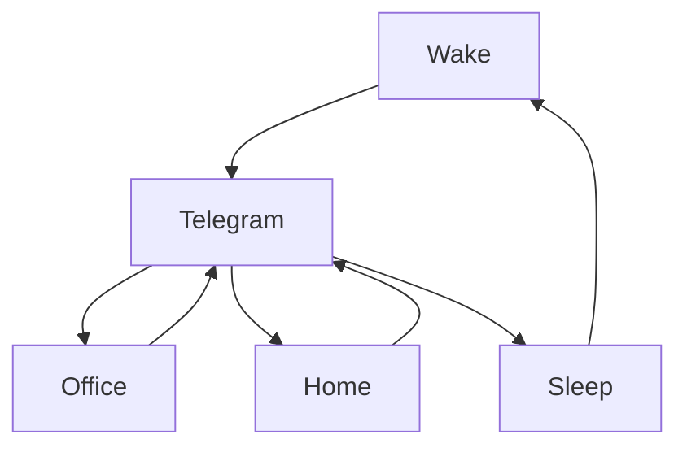

### 🎬 1tamilmv RSS Feed

<!-- BLOG-POST-LIST:START -->
- [Doctor Strange in the Multiverse of Madness &lpar;2022&rpar; &lpar;HD + DD5.1 Original Auds&rpar; - [1080p &amp; 720p - x264 - [Tamil + Telugu + Hindi + Malayalam + Kannada + Eng] - 23GB - 8.1GB - 3.2GB - 1.8GB &amp; 900MB] - [x264 - &lpar;MULTI&rpar; - 700MB - 450MB &amp; 250MB] - ESub](https://www.1tamilmv.cloud/index.php?/forums/topic/164300-doctor-strange-in-the-multiverse-of-madness-2022-hd-dd51-original-auds-1080p-720p-x264-tamil-telugu-hindi-malayalam-kannada-eng-23gb-81gb-32gb-18gb-900mb-x264-multi-700mb-450mb-250mb-esub/&do=findComment&comment=328798)
- [Sarkaru Vaari Paata [2022] Dual Audio [Hindi Telugu]](https://www.1tamilmv.cloud/index.php?/forums/topic/164366-sarkaru-vaari-paata-2022-dual-audio-hindi-telugu/&do=findComment&comment=328797)
- [Pokkiri Rasigan &lpar;2022&rpar; Tamil TRUE WEB-DL - [1080p &amp; 720p - x264 - [Tamil &lpar;Original Audio&rpar; + Malayalam] - 2.8GB - 1.4GB &amp; 850MB | x264 - 700MB - 400MB &amp; 250MB] - ESub](https://www.1tamilmv.cloud/index.php?/forums/topic/164333-pokkiri-rasigan-2022-tamil-true-web-dl-1080p-720p-x264-tamil-original-audio-malayalam-28gb-14gb-850mb-x264-700mb-400mb-250mb-esub/&do=findComment&comment=328796)
- [Nenjuku Needhi &lpar; 2022 &rpar;](https://www.1tamilmv.cloud/index.php?/forums/topic/164365-nenjuku-needhi-2022/&do=findComment&comment=328795)
- [[G-DRIVE] DOCTOR STRANGE IN THE MULTIVERSE OF MADNESS &lpar;2022&rpar; &lpar;HD + DD5.1 ORIGINAL AUDS&rpar; - [1080P &amp; 720P - X264 - [TAMIL + TELUGU + HINDI + MALAYALAM + KANNADA + ENG] - 23GB - 8.1GB - 3.2GB - 1.8GB &amp; 900MB] - [X264 - &lpar;MULTI&rpar; - 700MB - 450MB &amp; 250MB] - ESUB](https://www.1tamilmv.cloud/index.php?/forums/topic/164341-g-drive-doctor-strange-in-the-multiverse-of-madness-2022-hd-dd51-original-auds-1080p-720p-x264-tamil-telugu-hindi-malayalam-kannada-eng-23gb-81gb-32gb-18gb-900mb-x264-multi-700mb-450mb-250mb-esub/&do=findComment&comment=328794)
<!-- BLOG-POST-LIST:END -->

# =====Spotify Playlist=====

 

 
<h3 align="center">  </h3>
 

<H1>My Routine</H1>

 

    
    
    

           

