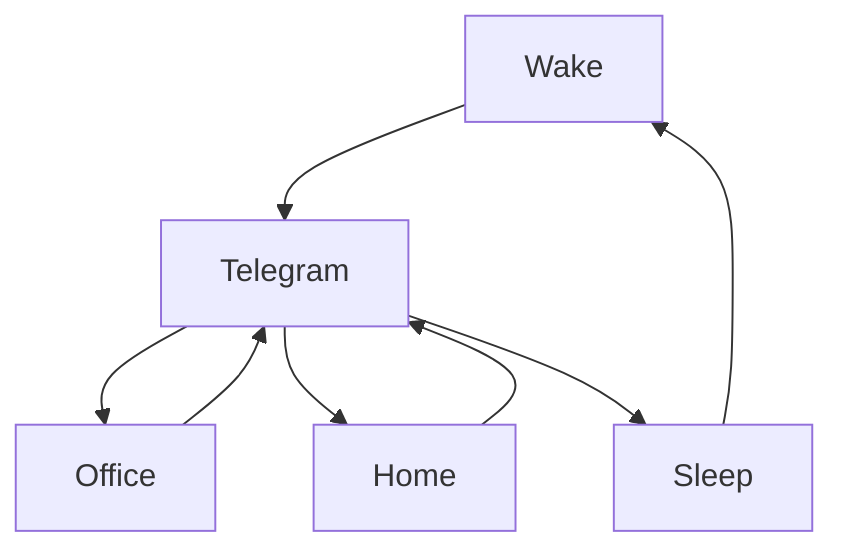

### 🎬 1tamilmv RSS Feed

<!-- BLOG-POST-LIST:START -->
- [Sammathame &lpar;2022&rpar; DVDScr Telugu Full Movie](https://www.1tamilmv.cloud/index.php?/forums/topic/164450-sammathame-2022-dvdscr-telugu-full-movie/&do=findComment&comment=328920)
- [Spiderhead &lpar;2022&rpar; [HDRip - [Tamil + Telugu + Hindi] - x264 - AAC - 400MB - 250MB - 700MB 1.3GB - ESubs]](https://www.1tamilmv.cloud/index.php?/forums/topic/164449-spiderhead-2022-hdrip-tamil-telugu-hindi-x264-aac-400mb-250mb-700mb-13gb-esubs/&do=findComment&comment=328919)
- [4K 2160p 60FPS PREMIUM QUALITY UHD Songs/Clips/UHD Photos @TELEGRAM | UHD HUNTERYT](https://www.1tamilmv.cloud/index.php?/forums/topic/164288-4k-2160p-60fps-premium-quality-uhd-songsclipsuhd-photos-telegram-uhd-hunteryt/&do=findComment&comment=328917)
- [Kanaa Kaanum Kaalangal &lpar;2022&rpar; S01 EP &lpar;35-38&rpar; Tamil - 720p HQ HDRip - x264 - AAC - 400MB - ESub](https://www.1tamilmv.cloud/index.php?/forums/topic/164415-kanaa-kaanum-kaalangal-2022-s01-ep-35-38-tamil-720p-hq-hdrip-x264-aac-400mb-esub/&do=findComment&comment=328916)
- [𝗔𝘁𝗵𝗶𝗱𝗵𝗶 𝗗𝗲𝘃𝗼 𝗕𝗵𝗮𝘃𝗮 &lpar;𝟮𝟬𝟮𝟮&rpar; 𝐓𝐞𝐥𝐮𝐠𝐮 &lpar;𝐌𝐔𝐒𝐈𝐂 𝐕𝐈𝐃𝐄𝐎 𝐀𝐋𝐁𝐔𝐌&rpar; 𝟏𝟎𝟖𝟎𝐩 𝐖𝐄𝐁-𝐇𝐃 𝐔𝐍𝐓𝐎𝐔𝐂𝐇𝐄𝐃 - 𝐀𝐕𝐂 - [𝐃𝐃 𝟓.𝟏 &lpar;𝟯𝟮𝟬𝐊𝐛𝐩𝐬&rpar;] 𝐄-𝐒𝐮𝐛𝐬 𝐁𝐲-𝐁𝐞𝐚𝐬𝐭 𝐔𝐊](https://www.1tamilmv.cloud/index.php?/forums/topic/164448-%F0%9D%97%94%F0%9D%98%81%F0%9D%97%B5%F0%9D%97%B6%F0%9D%97%B1%F0%9D%97%B5%F0%9D%97%B6-%F0%9D%97%97%F0%9D%97%B2%F0%9D%98%83%F0%9D%97%BC-%F0%9D%97%95%F0%9D%97%B5%F0%9D%97%AE%F0%9D%98%83%F0%9D%97%AE-%F0%9D%9F%AE%F0%9D%9F%AC%F0%9D%9F%AE%F0%9D%9F%AE-%F0%9D%90%93%F0%9D%90%9E%F0%9D%90%A5%F0%9D%90%AE%F0%9D%90%A0%F0%9D%90%AE-%F0%9D%90%8C%F0%9D%90%94%F0%9D%90%92%F0%9D%90%88%F0%9D%90%82-%F0%9D%90%95%F0%9D%90%88%F0%9D%90%83%F0%9D%90%84%F0%9D%90%8E-%F0%9D%90%80%F0%9D%90%8B%F0%9D%90%81%F0%9D%90%94%F0%9D%90%8C-%F0%9D%9F%8F%F0%9D%9F%8E%F0%9D%9F%96%F0%9D%9F%8E%F0%9D%90%A9-%F0%9D%90%96%F0%9D%90%84%F0%9D%90%81-%F0%9D%90%87%F0%9D%90%83-%F0%9D%90%94%F0%9D%90%8D%F0%9D%90%93%F0%9D%90%8E%F0%9D%90%94%F0%9D%90%82%F0%9D%90%87%F0%9D%90%84%F0%9D%90%83-%F0%9D%90%80%F0%9D%90%95%F0%9D%90%82-%F0%9D%90%83%F0%9D%90%83-%F0%9D%9F%93%F0%9D%9F%8F-%F0%9D%9F%AF%F0%9D%9F%AE%F0%9D%9F%AC%F0%9D%90%8A%F0%9D%90%9B%F0%9D%90%A9%F0%9D%90%AC-%F0%9D%90%84-%F0%9D%90%92%F0%9D%90%AE%F0%9D%90%9B%F0%9D%90%AC-%F0%9D%90%81%F0%9D%90%B2-%F0%9D%90%81%F0%9D%90%9E%F0%9D%90%9A%F0%9D%90%AC%F0%9D%90%AD-%F0%9D%90%94%F0%9D%90%8A/&do=findComment&comment=328915)
<!-- BLOG-POST-LIST:END -->

# =====Spotify Playlist=====

 

 
<h3 align="center">  </h3>
 

<H1>My Routine</H1>

 

    
    
    

           

