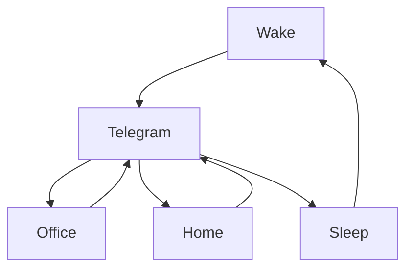

 

*************
<H1>My Routine</H1>

```mermaid
  graph TD;
      Wake-->Telegram;
      Telegram-->Office;
      Office-->Telegram;
      Telegram-->Home;
      Home-->Telegram;
      Telegram-->Sleep;
      Sleep-->Wake;
```

 

    
    
    

