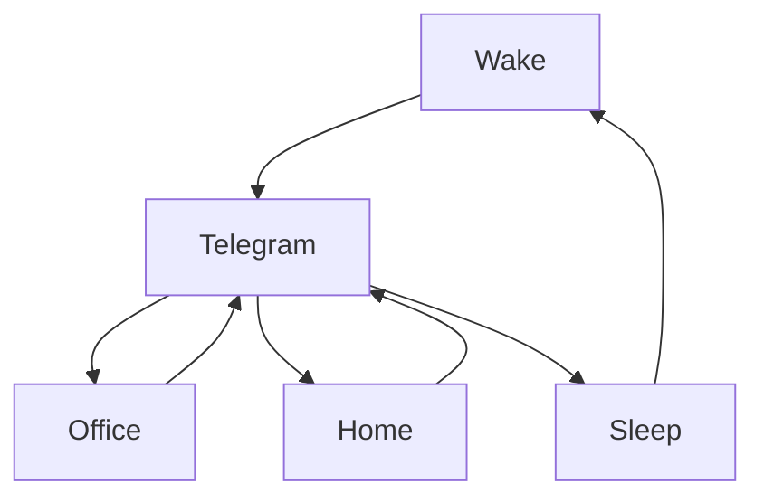

### 🎬 1tamilmv RSS Feed

<!-- BLOG-POST-LIST:START -->
- [How to find the best quality but smaller file size of movie files | Best quality യും എന്നാൽ file size കുറഞ്ഞതുമായ files എങ്ങനെ കണ്ടു പിടിക്കാം ???](https://www.1tamilmv.click/index.php?/forums/topic/166029-how-to-find-the-best-quality-but-smaller-file-size-of-movie-files-best-quality-%E0%B4%AF%E0%B5%81%E0%B4%82-%E0%B4%8E%E0%B4%A8%E0%B5%8D%E0%B4%A8%E0%B4%BE%E0%B5%BD-file-size-%E0%B4%95%E0%B5%81%E0%B4%B1%E0%B4%9E%E0%B5%8D%E0%B4%9E%E0%B4%A4%E0%B5%81%E0%B4%AE%E0%B4%BE%E0%B4%AF-files-%E0%B4%8E%E0%B4%99%E0%B5%8D%E0%B4%99%E0%B4%A8%E0%B5%86-%E0%B4%95%E0%B4%A3%E0%B5%8D%E0%B4%9F%E0%B5%81-%E0%B4%AA%E0%B4%BF%E0%B4%9F%E0%B4%BF%E0%B4%95%E0%B5%8D%E0%B4%95%E0%B4%BE%E0%B4%82/&do=findComment&comment=331545)
- [Jurassic World Dominion &lpar;2022&rpar; &lpar;HD + Original Audios&rpar; - [4K, 1080p &amp; 720p - x264 - &lpar;DD+5.1 - 640Kbps&rpar; &lpar;Tamil + Telugu + Hindi + Eng&rpar; - 8.6GB - 4.5GB &amp; 1.6GB | x264 - &lpar;Tam + Tel&rpar; - 700MB - 450MB &amp; 250MB] - ESub](https://www.1tamilmv.click/index.php?/forums/topic/165960-jurassic-world-dominion-2022-hd-original-audios-4k-1080p-720p-x264-dd51-640kbps-tamil-telugu-hindi-eng-86gb-45gb-16gb-x264-tam-tel-700mb-450mb-250mb-esub/&do=findComment&comment=331544)
- [Thirumalai &lpar;2003&rpar; Tamil 1080p Astro HD 6.5GB.mkv](https://www.1tamilmv.click/index.php?/forums/topic/166028-thirumalai-2003-tamil-1080p-astro-hd-65gbmkv/&do=findComment&comment=331543)
- [Power Rangers &lpar;2017&rpar; WEB-DL - OPEN MATTE - 1080p [Tamil + Telugu + Hindi] DDP5.1 &lpar;640Kbps&rpar; + [English - DTS5.1 &lpar;1510Kbps&rpar;] - H.264 - 7.2GB - ESub.mkv](https://www.1tamilmv.click/index.php?/forums/topic/166027-power-rangers-2017-web-dl-open-matte-1080p-tamil-telugu-hindi-ddp51-640kbps-english-dts51-1510kbps-h264-72gb-esubmkv/&do=findComment&comment=331542)
- [Vanavarayan Vallavarayan &lpar;2014&rpar; AMZN - WEB-DL [1080p - Tamil - DDP5.1 &lpar;640Kbps&rpar;] - H.264 - 11.2GB - ESub.mkv G - DRIVE](https://www.1tamilmv.click/index.php?/forums/topic/166026-vanavarayan-vallavarayan-2014-amzn-web-dl-1080p-tamil-ddp51-640kbps-h264-112gb-esubmkv-g-drive/&do=findComment&comment=331541)
<!-- BLOG-POST-LIST:END -->

# =====Spotify Playlist=====

 

 
<h3 align="center">  </h3>
 

<H1>My Routine</H1>

 

    
    
    

        

# Humans

# Bike N Angel

# Hypnotic Loop

https://user-images.githubusercontent.com/47528708/176845771-6ad8f1d2-8008-4f49-ac35-5ebb89644732.mp4

