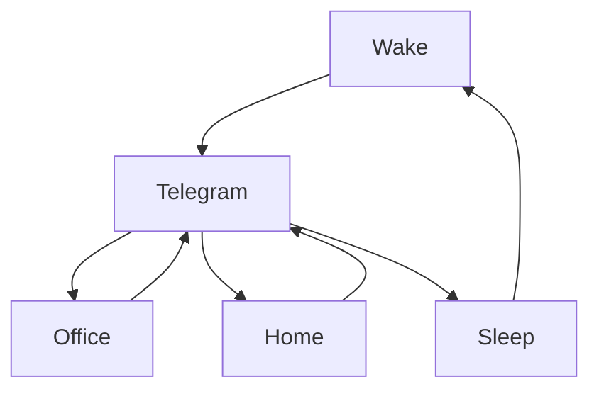

### 🎬 1tamilmv RSS Feed

<!-- BLOG-POST-LIST:START -->
- [Meme Boys &lpar;2022&rpar; S01 EP &lpar;01-08&rpar; TRUE WEB-DL - [1080p &amp; 720p - AVC - [Tam + Tel + Mal + Hin + Kan] - 4.8GB &amp; 3GB] - [x264 - 900MB &amp; 500MB] - ESub](https://www.1tamilmv.click/index.php?/forums/topic/166035-meme-boys-2022-s01-ep-01-08-true-web-dl-1080p-720p-avc-tam-tel-mal-hin-kan-48gb-3gb-x264-900mb-500mb-esub/&do=findComment&comment=331558)
- [Sita Ramam - Kannukkulle - DD5.1 640Kbps + DTSHDMA 5.1 &lpar;Lossless 24Bit FLAC Upmix&rpar; - HQ Mkv Audio ❤️ - Mediafire](https://www.1tamilmv.click/index.php?/forums/topic/166034-sita-ramam-kannukkulle-dd51-640kbps-dtshdma-51-lossless-24bit-flac-upmix-hq-mkv-audio-%E2%9D%A4%EF%B8%8F-mediafire/&do=findComment&comment=331557)
- [Gulu Gulu - Maatna Gaali - SaNa - DD5.1 &amp; DTSHDMA5.1 &lpar;Lossless 24Bit FLAC Upmix&rpar; - HQ Mkv AUDIO ❤️ - Mediafire](https://www.1tamilmv.click/index.php?/forums/topic/166033-gulu-gulu-maatna-gaali-sana-dd51-dtshdma51-lossless-24bit-flac-upmix-hq-mkv-audio-%E2%9D%A4%EF%B8%8F-mediafire/&do=findComment&comment=331556)
- [Chokka Thangam &lpar;2003&rpar;.Tamil.480p.Web-dl.x264.AAC2.0 - 2.2GB - Douploads](https://www.1tamilmv.click/index.php?/forums/topic/166032-chokka-thangam-2003tamil480pweb-dlx264aac20-22gb-douploads/&do=findComment&comment=331555)
- [Kannukkulle &lpar;From &quot;Sita Ramam &lpar;Tamil&rpar;&quot;&rpar; - Vishal Chandrashekhar - FLAC [24bit|16bit] | MP3 [320kbps|128kbps] - 48 MB | 25 MB | 9 MB | 4 MB](https://www.1tamilmv.click/index.php?/forums/topic/166002-kannukkulle-from-sita-ramam-tamil-vishal-chandrashekhar-flac-24bit16bit-mp3-320kbps128kbps-48-mb-25-mb-9-mb-4-mb/&do=findComment&comment=331554)
<!-- BLOG-POST-LIST:END -->

# =====Spotify Playlist=====

 

 
<h3 align="center">  </h3>
 

<H1>My Routine</H1>

 

    
    
    

        

# Humans

# Bike N Angel

# Hypnotic Loop

https://user-images.githubusercontent.com/47528708/176845771-6ad8f1d2-8008-4f49-ac35-5ebb89644732.mp4

