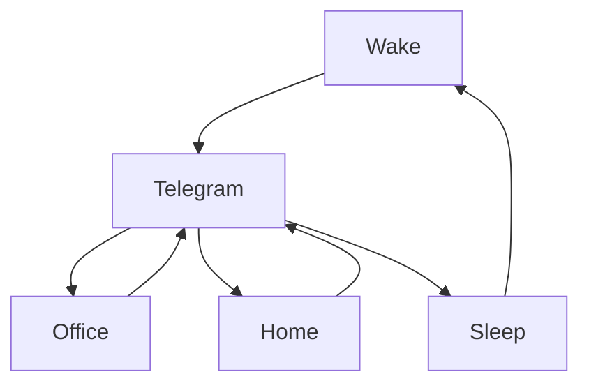

### 🎬 1tamilmv RSS Feed

<!-- BLOG-POST-LIST:START -->
- [Suzhal The Vortex &lpar;2022&rpar; - S01 - Complete - Multi Auds[Tel + Tam + Kan + Mal + Hin + Eng] - [4K|1080P|720P] - AC3&lpar;DD+5.1&rpar; - [640|128Kbps] - ESubs - [44GB|40GB|22GB|6.9GB|4.8GB|4GB] - [DSM] - [DSM]](https://www.1tamilmv.cloud/index.php?/forums/topic/164098-suzhal-the-vortex-2022-s01-complete-multi-audstel-tam-kan-mal-hin-eng-4k1080p720p-ac3dd51-640128kbps-esubs-44gb40gb22gb69gb48gb4gb-dsm-dsm/&do=findComment&comment=328786)
- [@Benzmovies - The Matrix &lpar;1999&rpar; REMASTERED BluRay - 4K HDR &lpar;D.Vision&rpar; - HEVC - x265 - &lpar;AAC 2.0&rpar;[Tamil + Telugu + Hindi &lpar;DD 5.1&rpar; + ENG &lpar;THD 7.1 ATMOS&rpar; - 19.7GB - ESub [ATMOS - GDrive] Benz.mkv 19.7GB](https://www.1tamilmv.cloud/index.php?/forums/topic/164364-benzmovies-the-matrix-1999-remastered-bluray-4k-hdr-dvision-hevc-x265-aac-20tamil-telugu-hindi-dd-51-eng-thd-71-atmos-197gb-esub-atmos-gdrive-benzmkv-197gb/&do=findComment&comment=328785)
- [@Benzmovies - TENET &lpar;2020&rpar; 2160p &lpar;4K&rpar; HDR10 - Multi  Original Audios [Tamil + Telugu + Hindi + Eng] - ESubs Benz.mkv 18.2GB](https://www.1tamilmv.cloud/index.php?/forums/topic/164363-benzmovies-tenet-2020-2160p-4k-hdr10-multi-original-audios-tamil-telugu-hindi-eng-%C2%A0esubs-benzmkv-182gb/&do=findComment&comment=328784)
- [@Benzmovies - Kick &lpar;2009&rpar; Complete Blu-Ray AVC DD+5.1 Benz.zip 41.6GB](https://www.1tamilmv.cloud/index.php?/forums/topic/164362-benzmovies-kick-2009-complete-blu-ray-avc-dd51-benzzip-416gb/&do=findComment&comment=328783)
- [@Movieshola  Akhanda &lpar;2021&rpar; 2160p HQ SDR DSNP WEB-DL x265 [Telugu &lpar;DD+ 5.1 - 192Kbps &amp; AAC 2.0&rpar;] ESubs.mkv  23.5GB](https://www.1tamilmv.cloud/index.php?/forums/topic/164361-movieshola-akhanda-2021-2160p-hq-sdr-dsnp-web-dl-x265-telugu-dd-51-192kbps-aac-20-esubsmkv-235gb/&do=findComment&comment=328782)
<!-- BLOG-POST-LIST:END -->

# =====Spotify Playlist=====

 

 
<h3 align="center">  </h3>
 

<H1>My Routine</H1>

 

    
    
    

