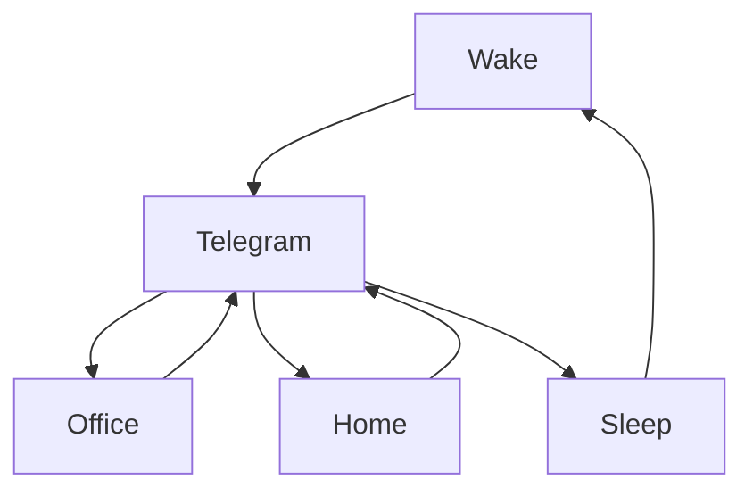

### 🎬 1tamilmv RSS Feed

<!-- BLOG-POST-LIST:START -->
- [[144FPS|60FPS].Vikram.2022.1080p.10bit.DSNP.WEBRip.Multi.DDP5.1.H.265.Homelander.mkv - 144FPS | 60FPS - 18.5 GB | 11.7 GB](https://www.1tamilmv.space/index.php?/forums/topic/165299-144fps60fpsvikram20221080p10bitdsnpwebripmultiddp51h265homelandermkv-144fps-60fps-185-gb-117-gb/&do=findComment&comment=330349)
- [The.Boys.S03.Complete.AMZN.[WEB-DL|WEBRip].Esubs - 2160p [HDR] | 1080p [144FPS|60FPS|10bit] | 720p [10bit] - 57.82 GB | 57.72 GB | 38.25 GB | 35.83 GB | 19.68 GB | 5.80 GB | 2.47 GB](https://www.1tamilmv.space/index.php?/forums/topic/165332-theboyss03completeamznweb-dlwebripesubs-2160p-hdr-1080p-144fps60fps10bit-720p-10bit-5782-gb-5772-gb-3825-gb-3583-gb-1968-gb-580-gb-247-gb/&do=findComment&comment=330348)
- [Ante.Sundaraniki.2022.NF.WEB-DL.Multi.DDP5.1.Esubs.x264 - 1080p | 720p - 9.4 GB | 6 GB](https://www.1tamilmv.space/index.php?/forums/topic/165331-antesundaraniki2022nfweb-dlmultiddp51esubsx264-1080p-720p-94-gb-6-gb/&do=findComment&comment=330347)
- [Vikram &lpar;2022&rpar; Tamil TRUE WEB-DL - [4K, 1080p &amp; 720p - HEVC / AVC - 28GB - 12.6GB - 8.3GB - 5GB - 3.2GB - 1.8GB - 1.4GB &amp; 950MB] - [x264 - 700MB - 400MB &amp; 250MB] - Soft ESub](https://www.1tamilmv.space/index.php?/forums/topic/165166-vikram-2022-tamil-true-web-dl-4k-1080p-720p-hevc-avc-28gb-126gb-83gb-5gb-32gb-18gb-14gb-950mb-x264-700mb-400mb-250mb-soft-esub/&do=findComment&comment=330346)
- [Hurdang &lpar;2022&rpar; Hindi TRUE WEB-DL - [1080p &amp; 720p - AVC - &lpar;DD+5.1 - 640Kbps&rpar; - 2.2GB &amp; 800MB] - [x264 - Hindi - 700MB &amp; 400MB] - ESub](https://www.1tamilmv.space/index.php?/forums/topic/165330-hurdang-2022-hindi-true-web-dl-1080p-720p-avc-dd51-640kbps-22gb-800mb-x264-hindi-700mb-400mb-esub/&do=findComment&comment=330345)
<!-- BLOG-POST-LIST:END -->

# =====Spotify Playlist=====

 

 
<h3 align="center">  </h3>
 

<H1>My Routine</H1>

 

    
    
    

     

# Humans

# Bike N Angel

# Hypnotic Loop

https://user-images.githubusercontent.com/47528708/176845771-6ad8f1d2-8008-4f49-ac35-5ebb89644732.mp4

