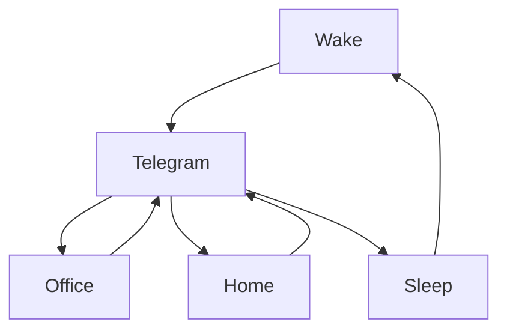

### 🎬 1tamilmv RSS Feed

<!-- BLOG-POST-LIST:START -->
- [Anaconda Trilogy &lpar;1997 to 2009&rpar; [720p - BDRip&#39;s - [Tamil + Telugu &lpar;2&rpar; + Hindi &lpar;2&rpar; + Eng] - x264 - 2.7GB] - ESub - Google Drive](https://www.1tamilmv.click/index.php?/forums/topic/165924-anaconda-trilogy-1997-to-2009-720p-bdrips-tamil-telugu-2-hindi-2-eng-x264-27gb-esub-google-drive/&do=findComment&comment=331374)
- [Infinite &lpar;2021&rpar; &lpar;BluRay + Original Audios&rpar; - [4K, 1080p &amp; 720p - x264 - &lpar;DD+5.1 - 640Kbps&rpar; &lpar;Tamil + Telugu + Hindi + Eng&rpar; - 6.1GB - 3.5GB &amp; 1.4GB | x264 - &lpar;Tam + Tel + Hin&rpar; - 450MB] - ESub](https://www.1tamilmv.click/index.php?/forums/topic/165904-infinite-2021-bluray-original-audios-4k-1080p-720p-x264-dd51-640kbps-tamil-telugu-hindi-eng-61gb-35gb-14gb-x264-tam-tel-hin-450mb-esub/&do=findComment&comment=331373)
- [Muthal Kadhal [Modalasala] &lpar;2022&rpar; Tamil WEB-DL - [1080p &amp; 720p - x264 - [Tamil &lpar;Original Audio&rpar; + Kannada] - 2.4GB - 1.4GB &amp; | x264 - 700MB - 400MB &amp; 250MB]](https://www.1tamilmv.click/index.php?/forums/topic/165901-muthal-kadhal-modalasala-2022-tamil-web-dl-1080p-720p-x264-tamil-original-audio-kannada-24gb-14gb-x264-700mb-400mb-250mb/&do=findComment&comment=331372)
- [Spider-Man: No Way Home &lpar;2021&rpar; &lpar;UHD Blu-Ray + Original Audios&rpar; - [4K, 1080p &amp; 720p - HEVC / x264 - &lpar;Tamil + Telugu + Hindi + Eng&rpar; - 62GB - 6.8GB - 3.2GB - 1.7GB &amp; 900MB | x264 - 750MB - 450MB &amp; 250MB] - ESub - Google Drive](https://www.1tamilmv.click/index.php?/forums/topic/165923-spider-man-no-way-home-2021-uhd-blu-ray-original-audios-4k-1080p-720p-hevc-x264-tamil-telugu-hindi-eng-62gb-68gb-32gb-17gb-900mb-x264-750mb-450mb-250mb-esub-google-drive/&do=findComment&comment=331371)
- [Krrish &lpar;2006&rpar; Blu-Ray-Telugu &lpar; Dolby Digital® 5.1 - 448Kbps&rpar;+ Hindi &lpar;DTS HDMA 5.1&rpar; - [1080p - 14.5GB - 9GB - 6GB - 4GB - 2.5GB - 1.6GB | 720p - 1.4GB - 900MB | x264 - 700MB - 400MB - 250MB] + ESub](https://www.1tamilmv.click/index.php?/forums/topic/104367-krrish-2006-blu-ray-telugu-dolby-digital%C2%AE-51-448kbps-hindi-dts-hdma-51-1080p-145gb-9gb-6gb-4gb-25gb-16gb-720p-14gb-900mb-x264-700mb-400mb-250mb-esub/&do=findComment&comment=331370)
<!-- BLOG-POST-LIST:END -->

# =====Spotify Playlist=====

 

 
<h3 align="center">  </h3>
 

<H1>My Routine</H1>

 

    
    
    

        

# Humans

# Bike N Angel

# Hypnotic Loop

https://user-images.githubusercontent.com/47528708/176845771-6ad8f1d2-8008-4f49-ac35-5ebb89644732.mp4

