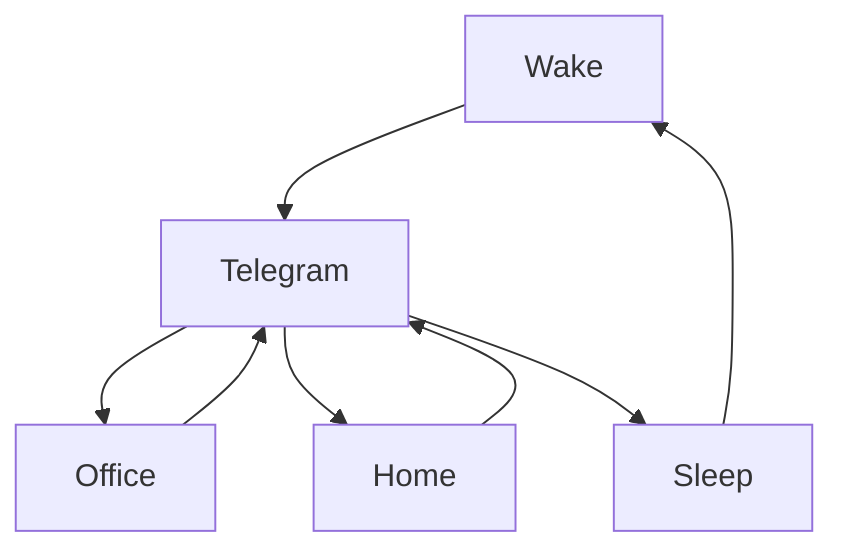

### 🎬 1tamilmv RSS Feed

<!-- BLOG-POST-LIST:START -->
- [♓Grand Theft Auto &lpar;GTA&rpar; I to V All PC Games Collection Multiple Repacks](https://www.1tamilmv.click/index.php?/forums/topic/165412-%E2%99%93grand-theft-auto-gta-i-to-v-all-pc-games-collection-multiple-repacks/&do=findComment&comment=330544)
- [Mounam Pesiyadhe &lpar;2002&rpar; Tamil 1080p AMZN WEB-DL - AVC - DDP2.0 &lpar;224Kbps&rpar; - x264 - 9.6GB - Esub.mkv](https://www.1tamilmv.click/index.php?/forums/topic/165444-mounam-pesiyadhe-2002-tamil-1080p-amzn-web-dl-avc-ddp20-224kbps-x264-96gb-esubmkv/&do=findComment&comment=330543)
- [Mankatha &lpar;2011&rpar; Tamil [1080p BluRay - DTS 5.1 &lpar;1509Kbps&rpar; - DD 5.1 &lpar;640Kbps&rpar; - x264 - 11GB - Esub].mkv](https://www.1tamilmv.click/index.php?/forums/topic/165443-mankatha-2011-tamil-1080p-bluray-dts-51-1509kbps-dd-51-640kbps-x264-11gb-esubmkv/&do=findComment&comment=330542)
- [Mankatha &lpar;2011&rpar; Tamil [1080p BluRay - DD 5.1 &lpar;640Kbps&rpar; - x264 - 5.8GB - Esub].mkv](https://www.1tamilmv.click/index.php?/forums/topic/165442-mankatha-2011-tamil-1080p-bluray-dd-51-640kbps-x264-58gb-esubmkv/&do=findComment&comment=330541)
- [Kuselan &lpar;2008&rpar; Tamil 1080p NF WEB-DL - AVC -  DDP5.1 &lpar;640Kbps&rpar; - AAC 2.0 - x264 - 8.3GB - Esub.mkv](https://www.1tamilmv.click/index.php?/forums/topic/165441-kuselan-2008-tamil-1080p-nf-web-dl-avc-ddp51-640kbps-aac-20-x264-83gb-esubmkv/&do=findComment&comment=330540)
<!-- BLOG-POST-LIST:END -->

# =====Spotify Playlist=====

 

 
<h3 align="center">  </h3>
 

<H1>My Routine</H1>

 

    
    
    

     

# Humans

# Bike N Angel

# Hypnotic Loop

https://user-images.githubusercontent.com/47528708/176845771-6ad8f1d2-8008-4f49-ac35-5ebb89644732.mp4

