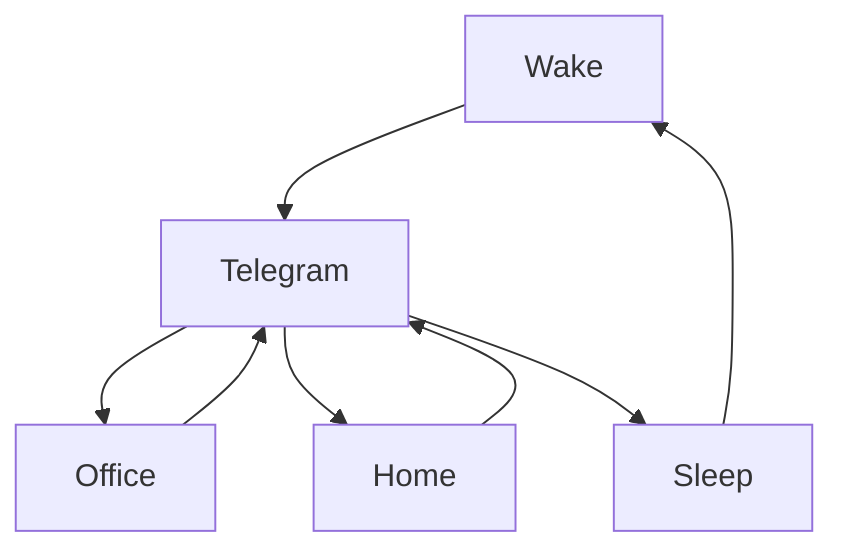

### 🎬 1tamilmv RSS Feed

<!-- BLOG-POST-LIST:START -->
- [Nenjuku Needhi &lpar;2022&rpar; Proper TRUE WEB-DL - [1080p &amp; 720p - AVC - &lpar;AAC 2.0 - 96Kbps&rpar; [Tamil + Telugu + Malayalam + Kannada] - 3.1GB - 1.4GB &amp; 950MB] - [x264 - &lpar;MULTI&rpar; - 800MB - 500MB] - ESub 🔰G-DRIVE🔰](https://www.1tamilmv.cloud/index.php?/forums/topic/164340-nenjuku-needhi-2022-proper-true-web-dl-1080p-720p-avc-aac-20-96kbps-tamil-telugu-malayalam-kannada-31gb-14gb-950mb-x264-multi-800mb-500mb-esub-%F0%9F%94%B0g-drive%F0%9F%94%B0/&do=findComment&comment=328754)
- [Nenjuku Needhi &lpar;2022&rpar; Proper TRUE WEB-DL - [1080p &amp; 720p - AVC - &lpar;AAC 2.0 - 96Kbps&rpar; [Tamil + Telugu + Malayalam + Kannada] - 3.1GB - 1.4GB &amp; 950MB] - [x264 - &lpar;MULTI&rpar; - 800MB - 500MB &amp; 300MB] - ESub](https://www.1tamilmv.cloud/index.php?/forums/topic/164325-nenjuku-needhi-2022-proper-true-web-dl-1080p-720p-avc-aac-20-96kbps-tamil-telugu-malayalam-kannada-31gb-14gb-950mb-x264-multi-800mb-500mb-300mb-esub/&do=findComment&comment=328753)
- [Krack &lpar;2021&rpar;.Tamil.1080p.Web-dl.x264.DD5.1 640Kbps &lpar;Upmix&rpar;.ESub - 2.9GB - GOFILE](https://www.1tamilmv.cloud/index.php?/forums/topic/139464-krack-2021tamil1080pweb-dlx264dd51-640kbps-upmixesub-29gb-gofile/&do=findComment&comment=328752)
- [Request your movies as a comment to this topic.!](https://www.1tamilmv.cloud/index.php?/forums/topic/79-request-your-movies-as-a-comment-to-this-topic/&do=findComment&comment=328751)
- [[18+] Gandii Baat Complete Season [S01 - S06] Hindi](https://www.1tamilmv.cloud/index.php?/forums/topic/164339-18-gandii-baat-complete-season-s01-s06-hindi/&do=findComment&comment=328750)
<!-- BLOG-POST-LIST:END -->

# =====Spotify Playlist=====

 

 
<h3 align="center">  </h3>
 

<H1>My Routine</H1>

 

    
    
    

