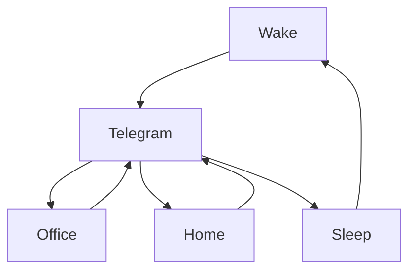

### 🎬 1tamilmv RSS Feed

<!-- BLOG-POST-LIST:START -->
- [Doctor Strange in the Multiverse of Madness &lpar;2022&rpar; - Multi Auds[Tel + Tam + Kan + Mal + Hin + Eng] - [4K|2K|1080P|720P] - HEVC - [AC3&lpar;DD+5.1&rpar; |AAC&lpar;5.1|2.0&rpar;] - [192|128|96Kbps] - ESubs - 34GB - [DSM]](https://www.1tamilmv.cloud/index.php?/forums/topic/164386-doctor-strange-in-the-multiverse-of-madness-2022-multi-audstel-tam-kan-mal-hin-eng-4k2k1080p720p-hevc-ac3dd51-aac5120-19212896kbps-esubs-34gb-dsm/&do=findComment&comment=328829)
- [18+ Blackmail Today Hot Web Series 720p UnRated](https://www.1tamilmv.cloud/index.php?/forums/topic/164392-18-blackmail-today-hot-web-series-720p-unrated/&do=findComment&comment=328828)
- [Manmatha Leela &lpar;2022&rpar; Telugu &lpar;Original Version&rpar; TRUE WEB-DL - [4K, 1080p &amp; 720p - HEVC / AVC - 4.1GB - 2.6GB - 1.4GB &amp; 900MB] - [x264 - 700MB - 400MB &amp; 250MB] - ESub](https://www.1tamilmv.cloud/index.php?/forums/topic/164391-manmatha-leela-2022-telugu-original-version-true-web-dl-4k-1080p-720p-hevc-avc-41gb-26gb-14gb-900mb-x264-700mb-400mb-250mb-esub/&do=findComment&comment=328827)
- [TWO-MOVIE REQUEST](https://www.1tamilmv.cloud/index.php?/forums/topic/164390-two-movie-request/&do=findComment&comment=328826)
- [Forensic &lpar;2022&rpar; Hindi TRUE WEB-DL - [1080p &amp; 720p - AVC - 2.5GB - 1.4GB] - [x264 - 700MB - 400MB - 250MB] - ESub](https://www.1tamilmv.cloud/index.php?/forums/topic/164389-forensic-2022-hindi-true-web-dl-1080p-720p-avc-25gb-14gb-x264-700mb-400mb-250mb-esub/&do=findComment&comment=328825)
<!-- BLOG-POST-LIST:END -->

# =====Spotify Playlist=====

 

 
<h3 align="center">  </h3>
 

<H1>My Routine</H1>

 

    
    
    

           

