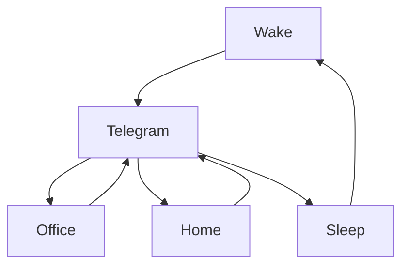

### 🎬 1tamilmv RSS Feed

<!-- BLOG-POST-LIST:START -->
- [Sarkaru Vaari Paata &lpar;2022&rpar; Tamil TRUE WEB-DL - [4K, 1080p &amp; 720p - AVC / HEVC - 12GB - 7.4GB - 3.5GB - 2.8GB - 1.6GB &amp; 1.2GB] - [x264 - 700MB - 400MB &amp; 250MB] - ESub](https://www.1tamilmv.space/index.php?/forums/topic/164677-sarkaru-vaari-paata-2022-tamil-true-web-dl-4k-1080p-720p-avc-hevc-12gb-74gb-35gb-28gb-16gb-12gb-x264-700mb-400mb-250mb-esub/&do=findComment&comment=329292)
- [50 Malayalam Movies - 1080p - AMZN / SUN NXT / MX / DSNP WEB DL - H.264 - DD5.1 / DDP2.0 / AAC2.0 - ESub - 250GD [Gdrive]](https://www.1tamilmv.space/index.php?/forums/topic/164532-50-malayalam-movies-1080p-amzn-sun-nxt-mx-dsnp-web-dl-h264-dd51-ddp20-aac20-esub-250gd-gdrive/&do=findComment&comment=329291)
- [Ranarangam &lpar;2019&rpar; Telugu JC WEB-DL - [1080p-8GB-4GB / 720p-1.3GB / 480p-900MB / 360p-700MB / 240p-450MB] - AVC - [DD+5.1 - 192kbps &amp; AAC 2.0] - Esubs - [GDriveLinks]](https://www.1tamilmv.space/index.php?/forums/topic/164690-ranarangam-2019-telugu-jc-web-dl-1080p-8gb-4gb-720p-13gb-480p-900mb-360p-700mb-240p-450mb-avc-dd51-192kbps-aac-20-esubs-gdrivelinks/&do=findComment&comment=329290)
- [🔰DOCTOR STRANGE - IN THE MULTIVERSE OF MADNESS &lpar;2022&rpar; - ENGLISH - &lpar;IMAX&rpar; -[4K - ULTRAHD] - &lpar;2160p&rpar; - [10BIT - HDR - WEB-HD] - &lpar;6CH x264 - DD+5.1 - 640Kbps &amp; AAC 2.0&rpar; -HEVC - DV - &lpar;5.23GB&rpar; - ESUB.mkv🔰](https://www.1tamilmv.space/index.php?/forums/topic/164711-%F0%9F%94%B0doctor-strange-in-the-multiverse-of-madness-2022-english-imax-4k-ultrahd-2160p-10bit-hdr-web-hd-6ch-x264-dd51-640kbps-aac-20-hevc-dv-523gb-esubmkv%F0%9F%94%B0/&do=findComment&comment=329289)
- [Stranger Things &lpar;2022&rpar; S04 VOL.1 EP&lpar;01-07&rpar; &lpar;HD + Original Audios&rpar; - [1080p &amp; 720p - x264 - &lpar;DD+5.1 - 192Kbps&rpar; [Tamil + Telugu + Hindi + Eng] - 6GB - 2.2GB &amp; 900MB] - ESub](https://www.1tamilmv.space/index.php?/forums/topic/163063-stranger-things-2022-s04-vol1-ep01-07-hd-original-audios-1080p-720p-x264-dd51-192kbps-tamil-telugu-hindi-eng-6gb-22gb-900mb-esub/&do=findComment&comment=329288)
<!-- BLOG-POST-LIST:END -->

# =====Spotify Playlist=====

 

 
<h3 align="center">  </h3>
 

<H1>My Routine</H1>

 

    
    
    

           

# Humans

       

