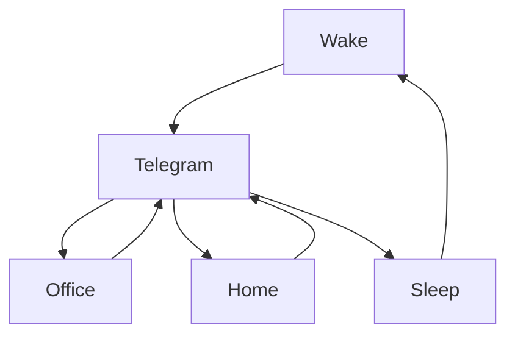

### 🎬 1tamilmv RSS Feed

<!-- BLOG-POST-LIST:START -->
- [Suzhal The Vortex &lpar;2022&rpar; S01 [ 4k 2160p HDR&amp;SDR + 1080p + 720p] HEVC DDP5.1-640kbps [Telugu+Tamil+Hindi+English+Malayalam]ESubs](https://www.1tamilmv.space/index.php?/forums/topic/164040-suzhal-the-vortex-2022-s01-4k-2160p-hdrsdr-1080p-720p-hevc-ddp51-640kbps-telugutamilhindienglishmalayalamesubs/&do=findComment&comment=329625)
- [Bhool Bhulaiyaa 2 &lpar;2022&rpar; - Hindi Video Songs - 1080p - WEB-DL - DDP5.1 &amp; DTS](https://www.1tamilmv.space/index.php?/forums/topic/164899-bhool-bhulaiyaa-2-2022-hindi-video-songs-1080p-web-dl-ddp51-dts/&do=findComment&comment=329624)
- [@Benzmovies - Toy Story 4 &lpar;2019&rpar; 2160p &lpar;4K&rpar; HDR10 - Multi  Original Audios [Tamil + Telugu + Hindi + Eng] - ESubs Benz.mkv 16.7GB](https://www.1tamilmv.space/index.php?/forums/topic/164896-benzmovies-toy-story-4-2019-2160p-4k-hdr10-multi-original-audios-tamil-telugu-hindi-eng-%C2%A0esubs-benzmkv-167gb/&do=findComment&comment=329623)
- [Beast &lpar;2022&rpar; - 1080p - WEB-DL &lpar;SUNXT&rpar; - [TAM + TEL + KAN + MAL] MULTI DDP 5.1 ATMOS](https://www.1tamilmv.space/index.php?/forums/topic/163003-beast-2022-1080p-web-dl-sunxt-tam-tel-kan-mal-multi-ddp-51-atmos/&do=findComment&comment=329622)
- [Beast &lpar;2022&rpar; - All Video Songs - 1080p - WEB-DL &lpar;NF&rpar; - [TAM + TEL + KAN + MAL + HIN] MULTI DDP 5.1](https://www.1tamilmv.space/index.php?/forums/topic/163007-beast-2022-all-video-songs-1080p-web-dl-nf-tam-tel-kan-mal-hin-multi-ddp-51/&do=findComment&comment=329621)
<!-- BLOG-POST-LIST:END -->

# =====Spotify Playlist=====

 

 
<h3 align="center">  </h3>
 

<H1>My Routine</H1>

 

    
    
    

     

# Humans

# Bike N Angel

# Hypnotic Loop

https://user-images.githubusercontent.com/47528708/176845771-6ad8f1d2-8008-4f49-ac35-5ebb89644732.mp4

