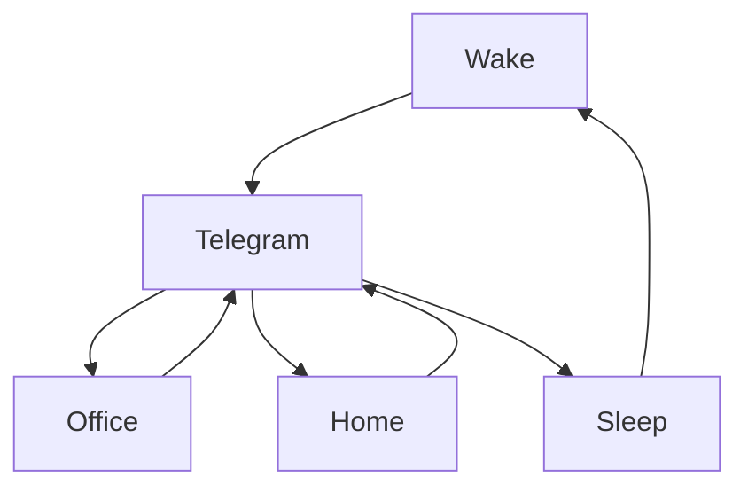

### 🎬 1tamilmv RSS Feed

<!-- BLOG-POST-LIST:START -->
- [Billa &lpar;2009&rpar; Telugu HD + &lpar;Dolby Digital® 5.1 - 448Kbps&rpar; - [1080p - 6GB - 4GB - 2.5GB - 1.6GB | 720p - 1.4GB - 900MB | x264 - 700MB - 400MB - 250MB]](https://www.1tamilmv.click/index.php?/forums/topic/129405-billa-2009-telugu-hd-dolby-digital%C2%AE-51-448kbps-1080p-6gb-4gb-25gb-16gb-720p-14gb-900mb-x264-700mb-400mb-250mb/&do=findComment&comment=330861)
- [The Warriorr &lpar;2022&rpar; [Tamil+Telugu] Proper HQ PreDVD - [720p - 1.4GB &amp; 900MB | x264 - 700MB - 400MB &amp; 250MB] - HQ Clean Audio {𝐃𝐢𝐫𝐞𝐜𝐭 𝐋𝐢𝐧𝐤}](https://www.1tamilmv.click/index.php?/forums/topic/165628-the-warriorr-2022-tamiltelugu-proper-hq-predvd-720p-14gb-900mb-x264-700mb-400mb-250mb-hq-clean-audio-%F0%9D%90%83%F0%9D%90%A2%F0%9D%90%AB%F0%9D%90%9E%F0%9D%90%9C%F0%9D%90%AD-%F0%9D%90%8B%F0%9D%90%A2%F0%9D%90%A7%F0%9D%90%A4/&do=findComment&comment=330860)
- [Maa Neella Tank &lpar;2022&rpar; S01 EP &lpar;01-08&rpar; Telugu TRUE WEB-DL - [4K, 1080p &amp; 720p - HEVC / AVC - 8.4GB - 4.4GB &amp; 2.1GB] - ESub_TheSUNNY_.[🔰G-DRIVE LINKS🔰]](https://www.1tamilmv.click/index.php?/forums/topic/165627-maa-neella-tank-2022-s01-ep-01-08-telugu-true-web-dl-4k-1080p-720p-hevc-avc-84gb-44gb-21gb-esub_thesunny_%F0%9F%94%B0g-drive-links%F0%9F%94%B0/&do=findComment&comment=330859)
- [Thevar Magan &lpar;1992&rpar; 1080P Tamil- HC-Esub - 1.8GB.mkv](https://www.1tamilmv.click/index.php?/forums/topic/165564-thevar-magan-1992-1080p-tamil-hc-esub-18gbmkv/&do=findComment&comment=330858)
- [[Gdrive] Bestie &lpar;2022&rpar; Tamil TRUE WEB-DL - [1080p &amp; 720p - AVC - AAC - 3.7GB - 2.4GB - 1.4GB &amp; 800MB] - [400MB]](https://www.1tamilmv.click/index.php?/forums/topic/165626-gdrive-bestie-2022-tamil-true-web-dl-1080p-720p-avc-aac-37gb-24gb-14gb-800mb-400mb/&do=findComment&comment=330857)
<!-- BLOG-POST-LIST:END -->

# =====Spotify Playlist=====

 

 
<h3 align="center">  </h3>
 

<H1>My Routine</H1>

 

    
    
    

        

# Humans

# Bike N Angel

# Hypnotic Loop

https://user-images.githubusercontent.com/47528708/176845771-6ad8f1d2-8008-4f49-ac35-5ebb89644732.mp4

