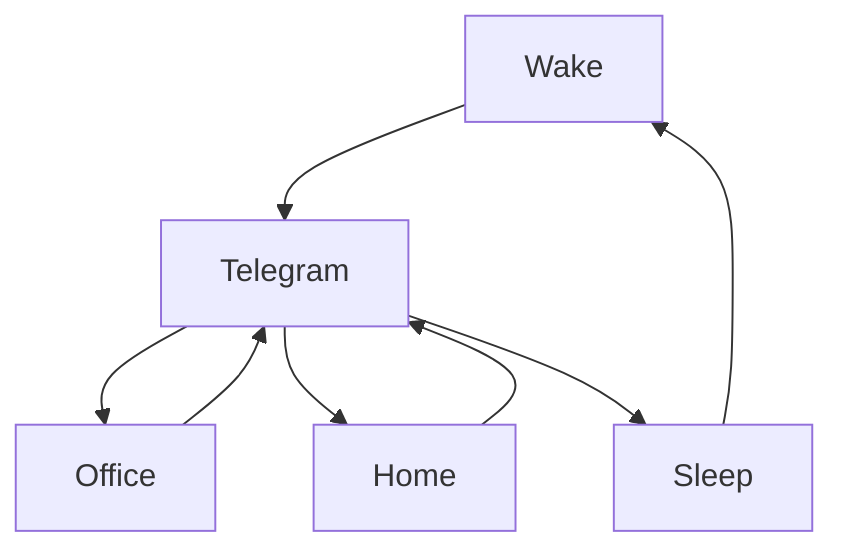

### 🎬 1tamilmv RSS Feed

<!-- BLOG-POST-LIST:START -->
- [Panni Kutty &lpar;2022&rpar; Tamil Proper HQ PreDVD - [1080p &amp; 720p - x264 - 2.6GB - 1.4GB &amp; 900MB | x264 - 700MB - 400MB &amp; 250MB] - HQ Clean Audio {𝐃𝐢𝐫𝐞𝐜𝐭 𝐋𝐢𝐧𝐤}](https://www.1tamilmv.space/index.php?/forums/topic/165303-panni-kutty-2022-tamil-proper-hq-predvd-1080p-720p-x264-26gb-14gb-900mb-x264-700mb-400mb-250mb-hq-clean-audio-%F0%9D%90%83%F0%9D%90%A2%F0%9D%90%AB%F0%9D%90%9E%F0%9D%90%9C%F0%9D%90%AD-%F0%9D%90%8B%F0%9D%90%A2%F0%9D%90%A7%F0%9D%90%A4/&do=findComment&comment=330300)
- [༒    Jurassic World Dominion &lpar;2022&rpar; Tamil HDRip - [720p - x264 - &lpar;Tamil + Eng&rpar; - 1.2GB &amp; 400MB] - HQ Clean Audio - Google Drive](https://www.1tamilmv.space/index.php?/forums/topic/165302-%E0%BC%92-jurassic-world-dominion-2022-tamil-hdrip-720p-x264-tamil-eng-12gb-400mb-hq-clean-audio-google-drive/&do=findComment&comment=330299)
- [༒     Pattampoochi &lpar;2022&rpar; Tamil TRUE WEB-DL - [4K, 1080p &amp; 720p - AVC / HEVC - 11GB - 8GB - 4GB - 2.5GB - 1.4GB &amp; 850MB] - [x264 - 700MB - 400MB &amp; 250MB] - Soft ESub - Google Drive](https://www.1tamilmv.space/index.php?/forums/topic/165301-%E0%BC%92-pattampoochi-2022-tamil-true-web-dl-4k-1080p-720p-avc-hevc-11gb-8gb-4gb-25gb-14gb-850mb-x264-700mb-400mb-250mb-soft-esub-google-drive/&do=findComment&comment=330298)
- [Toy Story &lpar;1995 - 2019&rpar; Quadrilogy [720p - BDRip&#39;s - [Tamil + Telugu + Hindi + Eng] - Esub]](https://www.1tamilmv.space/index.php?/forums/topic/165300-toy-story-1995-2019-quadrilogy-720p-bdrips-tamil-telugu-hindi-eng-esub/&do=findComment&comment=330297)
- [🔰High Speed Download Links🔰 Thani Oruvan &lpar;2015&rpar; UNCUT 720p 10bit JC WEBRip x265 HEVC [Org YT Hindi DD 2.0 ~192Kbps + Tamil DD 2.0] ESub ~ Immortal - 1.4GB](https://www.1tamilmv.space/index.php?/forums/topic/160913-%F0%9F%94%B0high-speed-download-links%F0%9F%94%B0-thani-oruvan-2015-uncut-720p-10bit-jc-webrip-x265-hevc-org-yt-hindi-dd-20-~192kbps-tamil-dd-20-esub-~-immortal-14gb/&do=findComment&comment=330296)
<!-- BLOG-POST-LIST:END -->

# =====Spotify Playlist=====

 

 
<h3 align="center">  </h3>
 

<H1>My Routine</H1>

 

    
    
    

     

# Humans

# Bike N Angel

# Hypnotic Loop

https://user-images.githubusercontent.com/47528708/176845771-6ad8f1d2-8008-4f49-ac35-5ebb89644732.mp4

