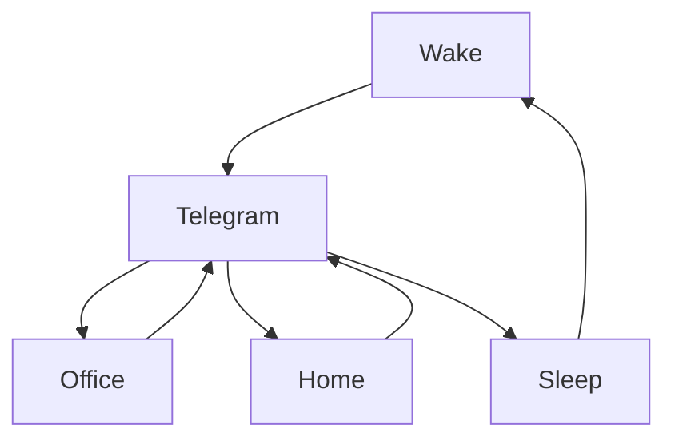

### 🎬 1tamilmv RSS Feed

<!-- BLOG-POST-LIST:START -->
- [Money.Heist.Korea.Joint.Economic.Area.S01.Complete.NF.WEB-DL.ENG-HIN.Esubs.x264- Single Episodes - 1080p DDP5.1 | 720p AAC2.0 - 17 GB | 2 GB](https://www.1tamilmv.cloud/index.php?/forums/topic/164447-moneyheistkoreajointeconomicareas01completenfweb-dleng-hinesubsx264-single-episodes-1080p-ddp51-720p-aac20-17-gb-2-gb/&do=findComment&comment=328913)
- [Money Heist: Korea – Joint Economic Area &lpar;Season 1&rpar; Dual Audio [Hindi + English] Complete Netflix Web Series 480p | 720p | 1080p](https://www.1tamilmv.cloud/index.php?/forums/topic/164446-money-heist-korea-%E2%80%93-joint-economic-area-season-1-dual-audio-hindi-english-complete-netflix-web-series-480p-720p-1080p/&do=findComment&comment=328912)
- [Thadam &lpar;2019&rpar; [4K TENTKOTTA  WEB-DL -AAC3 ]-.mkV](https://www.1tamilmv.cloud/index.php?/forums/topic/164445-thadam-2019-4k-tentkotta-web-dl-aac3-mkv/&do=findComment&comment=328911)
- [@Benzmovies - Annavaram &lpar;2006&rpar; Benz.mkv](https://www.1tamilmv.cloud/index.php?/forums/topic/164444-benzmovies-annavaram-2006-benzmkv/&do=findComment&comment=328910)
- [[DoVi] - The.Man.From.Toronto.2022.NF.WEB-DL.Multi.DDP5.1.Esubs - 1080p [DoVi] | 720p - 6.39 GB | 3.13 GB | 1.12 GB](https://www.1tamilmv.cloud/index.php?/forums/topic/164443-dovi-themanfromtoronto2022nfweb-dlmultiddp51esubs-1080p-dovi-720p-639-gb-313-gb-112-gb/&do=findComment&comment=328909)
<!-- BLOG-POST-LIST:END -->

# =====Spotify Playlist=====

 

 
<h3 align="center">  </h3>
 

<H1>My Routine</H1>

 

    
    
    

           

